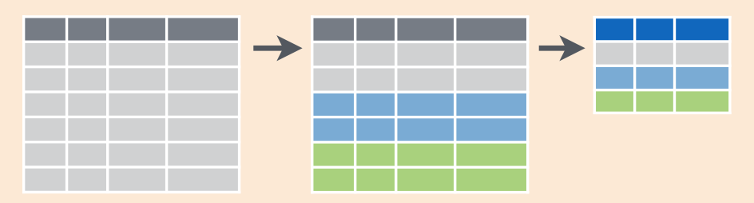

# Data Wrangling {#wrangling}

```{r setup_wrangling, include=FALSE, purl=FALSE}
# Used to define Learning Check numbers:
chap <- 3
lc <- 0

# Set R code chunk defaults:
opts_chunk$set(
  echo = TRUE,
  eval = TRUE,
  warning = FALSE,
  message = TRUE,
  tidy = FALSE,
  purl = TRUE,
  out.width = "\\textwidth",
  fig.height = 4,
  fig.align = "center"
)

# Set output digit precision
options(scipen = 99, digits = 3)

# In kable printing replace all NA's with blanks:
options(knitr.kable.NA = "")

# Set random number generator seed value for replicable pseudorandomness:
set.seed(76)
```

So far in our journey, we've seen how to look at data saved in data frames using the `glimpse()` and `View()` functions in Chapter \@ref(getting-started), and how to create data visualizations using the `ggplot2` package in Chapter \@ref(viz). In particular we studied what we term the "five named graphs" (5NG):

1. scatterplots via `geom_point()`
1. linegraphs via `geom_line()`
1. boxplots via `geom_boxplot()`
1. histograms via `geom_histogram()`
1. barplots via `geom_bar()` or `geom_col()`

We created these visualizations using the grammar of graphics, which maps variables in a data frame to the aesthetic attributes of one of the 5 `geom`etric objects. We can also control other aesthetic attributes of the geometric objects such as the size and color as seen in the Gapminder data example in Figure \@ref(fig:gapminder). 

Recall however that for two of our visualizations, we first needed to transform/modify existing data frames a little. For example, recall the scatterplot in Figure \@ref(fig:noalpha) of length and weight measurements *only* for brackish fish species. In order to create this visualization, we first needed to pare down the `all_fishdata` data frame to a `brackish_fish` data frame consisting of only `Brack == "1"` fish species Thus, `brackish_fish` will have fewer rows than `all_fishdata`. We did this using the `filter()` function:

```{r, eval=FALSE}
brackish_fish <- all_fishdata %>% 
  filter(Brack == 1)
```

In this chapter, we'll extend this example and we'll introduce a series of functions from the `dplyr` package for data wrangling that will allow you to take a data frame and "wrangle" it (transform it) to suit your needs. Such functions include:

1. `filter()` and `slice` a data frame's existing rows to only pick out a subset of them. For example, the `brackish_fish` data frame.
1. `select()` a data frame's existing columns to only pick out a subset of them or `rename` existing columns. 
1. `summarize()` one or more of its columns/variables with a *summary statistic*. Examples of summary statistics include the median and interquartile range of chick weights as we saw in Section \@ref(boxplots) on boxplots. 
1. `group_by()` its rows. In other words, assign different rows to be part of the same *group*. We can then combine `group_by()` with `summarize()` to report summary statistics for each group *separately*. For example, say you don't want a single overall average `weight` on Day 21 for the `chick_weight_d21` dataset, but rather four separate averages, one computed for each of the four `Diet` groups.
1. `mutate()` its existing columns/variables to create new ones. For example, convert weight recordings from grams to ounces.
1. `arrange()` its rows. For example, sort the rows of `all_fishdata` in ascending or descending order of `Length`.

Notice how we used `computer_code` font to describe the actions we want to take on our data frames. This is because the `dplyr` package for data wrangling has intuitively verb-named functions that are easy to remember. 

There is a further benefit to learning to use the `dplyr` package for data wrangling: its similarity to the database querying language [SQL](https://en.wikipedia.org/wiki/SQL) (pronounced "sequel" or spelled out as "S", "Q", "L"). SQL (which stands for "Structured Query Language") is used to manage large databases quickly and efficiently and is widely used by many institutions with a lot of data. While SQL is a topic left for a book or a course on database management, keep in mind that once you learn `dplyr`, you can learn SQL easily. We'll talk more about their similarities in Subsection \@ref(normal-forms).


### Needed packages {-#wrangling-packages}

Let's load all the packages needed for this chapter (this assumes you've already installed them). If needed, read Section \@ref(packages) for information on how to install and load R packages.

```{r, message=FALSE}
library(dplyr)
library(ggplot2)
library(rfishbase)
```

```{r message=FALSE, warning=FALSE, echo=FALSE, purl=FALSE}
# Packages needed internally, but not in text.
library(kableExtra)
library(readr)
library(stringr)
library(scales)
```


## The pipe operator: `%>%` {#piping}

Before we start data wrangling, let's first introduce a nifty tool that gets loaded with the `dplyr` package: the \index{operators!pipe} pipe operator `%>%`. The pipe operator allows us to combine multiple operations in R into a single sequential *chain* of actions.

Let's start with a hypothetical example. Say you would like to perform a hypothetical sequence of operations on a hypothetical data frame `x` using hypothetical functions `f()`, `g()`, and `h()`:

1. Take `x` *then*
1. Use `x` as an input to a function `f()` *then*
1. Use the output of `f(x)` as an input to a function `g()` *then*
1. Use the output of `g(f(x))` as an input to a function `h()`

One way to achieve this sequence of operations is by using nesting parentheses as follows:

```{r, eval=FALSE, purl=FALSE}
h(g(f(x)))
```

This code isn't so hard to read since we are applying only three functions: `f()`, then `g()`, then `h()` and each of the functions is short in its name. Further, each of these functions also only has one argument. However, you can imagine that this will get progressively harder to read as the number of functions applied in your sequence increases and the arguments in each function increase as well. This is where the pipe operator `%>%` comes in handy. `%>%` takes the output of one function and then "pipes" it to be the input of the next function. Furthermore, a helpful trick is to read `%>%` as "then" or "and then." For example, you can obtain the same output as the hypothetical sequence of functions as follows:

```{r, eval=FALSE, purl=FALSE}
x %>% 
  f() %>% 
  g() %>% 
  h()
```

You would read this sequence as:

1. Take `x` *then*
1. Use this output as the input to the next function `f()` *then*
1. Use this output as the input to the next function `g()` *then*
1. Use this output as the input to the next function `h()`

So while both approaches achieve the same goal, the latter is much more human-readable because you can clearly read the sequence of operations line-by-line. But what are the hypothetical `x`, `f()`, `g()`, and `h()`?  Throughout this chapter on data wrangling:

1. The starting value `x` will be a data frame. For example, the `all_fishdata` data frame we explored in Section \@ref(fishbasedataframe).
1. The sequence of functions, here `f()`, `g()`, and `h()`, will mostly be a sequence of any number of the data wrangling verb-named functions we listed in the introduction to this chapter. For example, the `filter(Brack == "1")` function and argument we previewed earlier.
1. The result will be the transformed/modified data frame that you want. In our example, we'll save the result in a new data frame by using the `<-` assignment operator with the name `brackish_fish` via `brackish_fish <-`.

```{r, eval=FALSE}
brackish_fish <- all_fishdata %>% 
  filter(Brack == "1")
```

Much like when adding layers to a `ggplot()` using the `+` sign, you form a single *chain* of data wrangling operations by combining verb-named functions into a single sequence using the pipe operator `%>%`. Furthermore, much like how the `+` sign has to come at the end of lines when constructing plots, the pipe operator `%>%` has to come at the end of lines as well. 

Keep in mind, there are many more advanced data wrangling functions than just those listed in the introduction to this chapter. However, just with these verb-named functions you'll be able to perform a broad array of data wrangling tasks for the rest of this book.


## `filter` rows {#filter}

```{r filter, fig.cap="Diagram of filter() rows operation.", echo=FALSE, purl=FALSE}
include_graphics("images/cheatsheets/filter.png")
```

The \index{dplyr!filter} `filter()` function here works much like the "Filter" option in Microsoft Excel; it allows you to specify criteria about the values of a variable in your dataset and then filters out only the rows that match that criteria.

We begin by focusing only on fish species found in `"public aquariums"`.  Run the following and look at the results in RStudio's spreadsheet viewer to ensure that only fish species in public aquariums are chosen here:

```{r, eval=FALSE}
paquarium_fish <- all_fishdata %>% 
  filter(Aquarium == "public aquariums")
View(paquarium_fish)
```

Note the order of the code. First, take the `all_fishdata` data frame; *then* `filter()` the data frame so that only those where `Aquarium` equals `"public aquariums"` are included. We test for equality using the double equal sign \index{operators!==} `==` and not a single equal sign `=`. In other words `filter(Aquarium = "public aquariums")` will yield an error. This is a convention across many programming languages. If you are new to coding, you'll probably forget to use the double equal sign `==` a few times before you get the hang of it.

You can use other operators \index{operators} beyond just the `==` operator that tests for equality:

- `>` corresponds to "greater than"
- `<` corresponds to "less than"
- `>=` corresponds to "greater than or equal to"
- `<=` corresponds to "less than or equal to"
- `!=` corresponds to "not equal to." The `!` is used in many programming languages to indicate "not."

Furthermore, you can combine multiple criteria using operators that make comparisons:

- `|` corresponds to "or"
- `&` corresponds to "and"

To see many of these in action, let's filter `all_fishdata` for aquarium fish species that are `"commercial"` or `"highly commercial"` *and* may be dangerous (not `"harmless"` and not`"Harmless"`).  Note that this example uses the \index{operators!not} `!` "not" operator to pick rows that *don't* match a criteria. As mentioned earlier, the `!` can be read as "not." Run the following:

```{r}
danger_comm_fish <- all_fishdata %>% 
  filter((Aquarium == "commercial" | Aquarium == "highly commercial") & Dangerous != "harmless" & Dangerous != "Harmless")
View(danger_comm_fish)
```

This alternative code where we do *not* select fish species that are `"harmless"` or `"Harmless"` achieves the same aim:

```{r, eval=FALSE}
danger_comm_fish <- all_fishdata %>% 
  filter((Aquarium == "commercial" | Aquarium == "highly commercial") & !(Dangerous == "harmless" | Dangerous == "Harmless"))
View(danger_comm_fish)
```

Note that even though colloquially speaking one might say "all fish species that are commercial *and* highly commercial," in terms of computer operations, we really mean "all fish species  that are commercial *or* highly commercial." For a given row in the data, `Aquarium` can be `"commercial"`, or `"highly commercial"`, or something else, but not both `"commercial"` and `"highly commercial"` at the same time. Furthermore, note the careful use of parentheses around `Aquarium == "commercial" | Aquarium == "highly commercial"` and `Dangerous == "harmless" | Dangerous == "Harmless"`.

We can often skip the use of `&` and just separate our conditions with a comma. The following code will return the identical output `danger_comm_fish` as the previous code:

```{r, eval=FALSE}
danger_comm_fish <- all_fishdata %>% 
  filter((Aquarium == "commercial" | Aquarium == "highly commercial"), !(Dangerous == "harmless" | Dangerous == "Harmless"))
View(danger_comm_fish)
```

Now say we have a larger number of categories we want to filter for, say `"commercial"`, `"highly commercial"`, `"show aquarium"`, and `"public aquariums"`. We could continue to use the `|` (*or*) \index{operators!or} operator:

```{r, eval=FALSE}
many_aquarium_fish <- all_fishdata %>% 
  filter(Aquarium == "commercial" | Aquarium == "highly commercial" | Aquarium == "show aquarium" | Aquarium == "public aquariums")
```

but as we progressively include more categories, this will get unwieldy to write. A slightly shorter approach uses the `%in%` \index{operators!in} operator along with the `c()` function. Recall from Subsection \@ref(programming-concepts) that the `c()` function "combines" or "concatenates" values into a single *vector* of values. \index{vectors}

```{r, eval=FALSE}
many_aquarium_fish <- all_fishdata %>% 
  filter(Aquarium %in% c("commercial", "highly commercial", "show aquarium", "public aquariums"))
View(many_aquarium_fish)
```

This code filters `all_fishdata` for all fish species where `Aquarium` is in the vector of types `c("commercial", "highly commercial", "show aquarium", "public aquariums")`. Both outputs of `many_aquarium_fish` are the same, but as you can see the latter takes much less energy to code. The `%in%` operator is useful for looking for matches commonly in one vector/variable compared to another.

As a final note, we recommend that `filter()` should often be among the first verbs you consider applying to your data. This cleans your dataset to only those rows you care about, or put differently, it narrows down the scope of your data frame to just the observations you care about. 

```{block lc-filter, type="learncheck", purl=FALSE}
\vspace{-0.15in}
**_Learning check_**
\vspace{-0.1in}
```

**`r paste0("(LC", chap, ".", (lc <- lc + 1), ")")`** Adapt the previous code using the "not" operator `!` to filter only the fish species that are not `commercial` or `highly commercial` in the `all_fishdata` data frame.

```{block, type="learncheck", purl=FALSE}
\vspace{-0.25in}
\vspace{-0.25in}
```


## `slice` rows

Similar to `filter`, the `slice` function  \index{dplyr!slice()} function returns a subset of row from a data frame. While `filter` returns the rows that match a specified criteria about the values of a variable (e.g., `Aquarium == "public aquariums"`), the `slice` function returns rows based on their positions.  For example, let's `slice` the first 100 rows of the `all_fishdata` data frame:

```{r, eval=FALSE}
all_fishdata %>% slice(1:100)
```

However, even more useful is a derivative of `slice` called `slice_max` that allow us to retrieve rows with the top values of a specified variable. For example, we can return a data frame of the 10 fish species found at the deepest depths. Observe that we set the number of values to return to `n = 10` and `order_by = DepthRangeDeep` to indicate that we want the rows corresponding to the top 10 values of `DepthRangeDeep`. 

```{r, eval=FALSE}
all_fishdata %>% slice_max(n = 10, order_by = DepthRangeDeep)
```

See the help file for `slice()` by running `?slice` for more information about its related functions. 

```{block lc-other-verbs, type="learncheck", purl=FALSE}
\vspace{-0.15in}
**_Learning check_**
\vspace{-0.1in}
```

**`r paste0("(LC", chap, ".", (lc <- lc + 1), ")")`** Repeat the previous command substituting the function `slice_head` for `slice_max`. How does the output differ?

**`r paste0("(LC", chap, ".", (lc <- lc + 1), ")")`** Create a new data frame `notDeep_fish` that shows the rows of the `all_fishdata` data frame with the 20 smallest values of the `DepthRangeDeep` variable. (Check the `slice()` help file for hints.)

```{block, type="learncheck", purl=FALSE}
\vspace{-0.25in}
\vspace{-0.25in}
```


## `select` variables {#select}

```{r echo=FALSE, purl=FALSE}
# This redundant code is used for dynamic non-static in-line text output purposes
# :: operator used as output was wrong otherwise
fishdata_cols <- all_fishdata %>%
  ncol() 
```

We recommended that you consider applying the `filter()` function to your data to narrow down the scope of your data frame to just the observations you care about. It may also be the case that you are only interested in a subset of the variables in your dataset. For example, the `all_fishdata` data frame has `r fishdata_cols` variables, but typically only a few variables will be of interest for a particular analysis. You can identify the names of these `r fishdata_cols` variables by running the `glimpse()` function from the `dplyr` package:

```{r, eval=FALSE}
glimpse(all_fishdata)
```

In the same way that `filter` and `slice` return a subset of rows, the `select` function and its selection helpers allow us to return a subset of columns from a data frame.

```{r selectfig, fig.cap="Diagram of select() columns.", echo=FALSE, purl=FALSE}
include_graphics("images/cheatsheets/select.png")
```

Returning to `danger_comm_fish`, our data frame with dangerous, commercial, aquarium fish species, we might only really be interested in the variables `Species`, `Aquarium`, and `Dangerous`. However, with the current data frame, it's very difficult to find these columns among all the others:  

```{r}
View(danger_comm_fish)
```

Examining these columns is much easier if we work with a smaller data frame by `select()`ing \index{dplyr!select()} the desired variables:

```{r}
slim_danger_comm_fish <- danger_comm_fish %>% 
  select(Species, Genus, Aquarium, Dangerous)
```

This slimmer data frame makes it easy to verify that we correctly `filtered` for `commercial` and `highly commercial` species and also helps us to see the various ways that fish are not "harmless":


```{r}
slim_danger_comm_fish
```

Let's say instead you want to drop, or de-select, certain variables. For example, it's apparent that the information in the `Genus` variable is already present in the `Species` variable, so we may want to remove the `Genus` variable. We can deselect `Genus` by using the `-` sign:

```{r, eval=FALSE}
slim_danger_comm_fish <- slim_danger_comm_fish %>% select(-Genus)
```

Another way of selecting columns/variables is by specifying a range of columns. For example, we might want to know which of the `danger_comm_fish` species live in fresh, brackish, or saltwater environments:

```{r}
slim2_danger_comm_fish <- danger_comm_fish %>% select(SpecCode:Species, Fresh:Saltwater)
slim2_danger_comm_fish
```

The `select()` function can also be used to reorder columns when combined with the `everything()` helper function.  For example, suppose we want the `Species`, `BodyShapeI`, `DepthRangeShallow` and `DepthRangeDeep` variables to appear first, while not discarding the rest of the variables. In the following code, `everything()` will pick up all remaining variables: 

```{r, eval=FALSE}
fishdata_reorder <- all_fishdata %>% 
  select(Species, BodyShapeI, DepthRangeShallow, DepthRangeDeep, everything())
glimpse(fishdata_reorder)
```

See the help file for `select()` by running `?select` for more information about other selection helpers. 

```{block lc-select, type="learncheck", purl=FALSE}
\vspace{-0.15in}
**_Learning check_**
\vspace{-0.1in}
```

**`r paste0("(LC", chap, ".", (lc <- lc + 1), ")")`** Run the code `all_fishdata %>% select(starts_with("Depth"))` to select columns with names that start with "Depth". How many columns are returned? 

**`r paste0("(LC", chap, ".", (lc <- lc + 1), ")")`** Use the `contains()` helper function to select columns from the `all_fishdata` data frame that contain "Pic". How many columns are returned? 

**`r paste0("(LC", chap, ".", (lc <- lc + 1), ")")`** What if you forgot to include the double-quotes for the first command above? Run the code `all_fishdata %>% select(starts_with(Depth))` to see what happens.

```{block, type="learncheck", purl=FALSE}
\vspace{-0.25in}
\vspace{-0.25in}
```

The last command shows an example of what happens when you forget to include double-quotes. 
If you see an `Error` message about an `object ... not found`, try adding double-quotes to see if that fixes the problem.

### `rename` variables {#rename}

Another useful function similar to `select()` is \index{dplyr!rename()} `rename()`, which as you may have guessed changes the name of specified variables. Suppose we want to rename the `DemersPelag` variable to something more understandable, such as `Preferred_Habitat`:

```{r, eval=FALSE}
all_fishdata %>% 
  rename(Preferred_Habitat = DemersPelag)
```

Only the name of the specified variable has changed, and all of the other variables remain intact and unchanged. Note that here we used a single `=` sign within the `rename()`. For example, `Preferred_Habitat = DemersPelag` renames the `DemersPelag` variable to have the new name `Preferred_Habitat`. This is because we are not testing for equality like we would using `==`. Instead we want to assign a new variable `Preferred_Habitat` to have the same values as `DemersPelag` and then delete the variable `DemersPelag`. 

Tip: New `dplyr` users often forget that the new variable name comes before the equal sign, followed by the old variable. You can remember this as "New Before Old". Tip 2: Avoid spaces and special symbols in your variable names, which in our experience can cause problems in R.

Pro-tip: We can also rename variables as we `select()` them from a data frame:

```{r}
all_fishdata %>% 
  select(Species, Preferred_Habitat = DemersPelag)
```

Here we selected two columns from `all_fishdata`, changing the name of the second one in the process.


## `summarize` variables {#summarize}

Another common task when working with data frames is to compute *summary statistics*. \index{summary statistics}Summary statistics are single numerical values that summarize a large number of values. Commonly known examples of summary statistics include the mean (also called the average) and the median (the middle value). Other examples of summary statistics that might not immediately come to mind include the *sum*, the smallest value also called the *minimum*, the largest value also called the *maximum*, and the *standard deviation*, a measure of the variability or "spread" in the values. See Appendix \@ref(appendix-stat-terms) for a glossary of such summary statistics.

Let's calculate two summary statistics of the `Length` variable in the `brackish_fish` data frame: the mean and standard deviation. To compute these summary statistics, we need the `mean()` and `sd()` *summary functions* in R. Summary functions in R take in many values and return a single value, as illustrated in Figure \@ref(fig:summary-function). 

```{r summary-function, fig.cap="Diagram illustrating a summary function in R.", echo=FALSE, purl=FALSE, fig.height=1.5}
include_graphics("images/cheatsheets/summary.png")
options(knitr.kable.NA = "NA")
```

More precisely, we'll use the `mean()` and `sd()` summary functions within the `summarize()` \index{dplyr!summarize()} function from the `dplyr` package. Note you can also use the British English spelling of `summarise()`. As shown in Figure \@ref(fig:sum1), the `summarize()` function takes in a data frame and returns a data frame with only one row corresponding to the summary statistics. 

```{r sum1, fig.cap="Diagram of summarize() rows.", echo=FALSE, purl=FALSE, out.height="80%", out.width="80%"}
include_graphics("images/cheatsheets/summarize1.png")
```

We'll save the results in a new data frame called `summary_brackish` that will have two columns/variables: the `mean` and the `std_dev`:

```{r}
summary_brackish <- brackish_fish %>% 
  summarize(mean = mean(Length), std_dev = sd(Length))
summary_brackish
```

Why are the values returned `NA`? As we saw in Subsection \@ref(geompoint) when creating the scatterplot of lengths and weights for `brackish_fish`, `NA` is how R encodes *missing values* \index{missing values} where `NA` indicates "not available" or "not applicable." If a value for a particular row and a particular column does not exist, `NA` is stored instead. Values can be missing for many reasons. Perhaps the data was collected but someone forgot to enter it? Perhaps the data was not collected at all because it was too difficult to do so? Perhaps there was an erroneous value that someone entered that has been corrected to read as missing? You'll often encounter issues with missing values when working with real data.

Going back to our `summary_brackish` output, by default any time you try to calculate a summary statistic of a variable that has one or more `NA` missing values in R, `NA` is returned. To work around this fact, you can set the `na.rm` argument to `TRUE`, where `rm` is short for "remove"; this will ignore any `NA` missing values and only return the summary value for all non-missing values. 

The code that follows computes the mean and standard deviation of all non-missing values of `Length`:

```{r}
summary_brackish <- brackish_fish %>% 
  summarize(mean = mean(Length, na.rm = TRUE), 
            std_dev = sd(Length, na.rm = TRUE))
summary_brackish
```

Notice how the `na.rm = TRUE` \index{functions!na.rm argument} are used as arguments to the `mean()` \index{mean()} and `sd()` \index{sd()} summary functions individually, and not to the `summarize()` function. 

However, one needs to be cautious whenever ignoring missing values as we've just done. In the upcoming *Learning checks* questions, we'll consider the possible ramifications of blindly sweeping rows with missing values "under the rug." This is in fact why the `na.rm` argument to any summary statistic function in R is set to `FALSE` by default. In other words, R does not ignore rows with missing values by default. R is alerting you to the presence of missing data and you should be mindful of this absence and any potential causes of this absence throughout your analysis.

What are other summary functions we can use inside the `summarize()` verb to compute summary statistics? As seen in the diagram in Figure \@ref(fig:summary-function), you can use any function in R that takes many values and returns just one. Here are just a few:

* `mean()`: the average
* `sd()`: the standard deviation, which is a measure of spread
* `min()` and `max()`: the minimum and maximum values, respectively
* `IQR()`: interquartile range
* `sum()`: the total amount when adding multiple numbers
* `n()`: a count of the number of rows in each group. This particular summary function will make more sense when `group_by()` is covered in Section \@ref(groupby).

```{block lc-summarize, type="learncheck", purl=FALSE}
\vspace{-0.15in}
**_Learning check_**
\vspace{-0.1in}
```

**`r paste0("(LC", chap, ".", (lc <- lc + 1), ")")`** Say a doctor is studying the effect of smoking on lung cancer for a large number of patients who have records measured at five-year intervals. She notices that a large number of patients have missing data points because the patient has died, so she chooses to ignore these patients in her analysis. What is wrong with this doctor's approach?

**`r paste0("(LC", chap, ".", (lc <- lc + 1), ")")`** Modify the earlier `summarize()` function code that creates the `summary_brackish` data frame to also use the `n()` summary function: `summarize(... , count = n())`. What does the returned value correspond to?

**`r paste0("(LC", chap, ".", (lc <- lc + 1), ")")`** Why doesn't the following code work?  Run the code line-by-line instead of all at once, and then look at the data.  In other words, run `summary2_brackish <- brackish_fish %>% summarize(mean = mean(Length, na.rm = TRUE))` first.

```{r eval=FALSE}
summary_wt_d21 <- brackish_fish %>%   
  summarize(mean = mean(Length, na.rm = TRUE)) %>% 
  summarize(std_dev = sd(Length, na.rm = TRUE))
```

```{block, type="learncheck", purl=FALSE}
\vspace{-0.25in}
\vspace{-0.25in}
```


## `group_by` rows {#groupby}

<!-- To get `_` to work in caption title. Found at https://github.com/rstudio/bookdown/issues/209 -->
(ref:groupby) Diagram of group_by() and summarize().

```{r groupsummarize, fig.cap="(ref:groupby)", echo=FALSE, purl=FALSE, fig.height=2.5}

```

Above we calculated the mean `Length` of `brackish_fish`.  Say instead of a single mean `Length` for a dataset, we would like to compute the mean lengths of fish species in different habitats separately, that is, the mean length split by preferred habitats. We can do this by "grouping" the `Length` observations by the values of another variable, in this case by the values of the variable `DemersPelag`. Run the following code:

<!--
New dplyr warning message when running group_by() %>% summarize() that is not
addressed in v1 (print edition). 
See https://github.com/moderndive/ModernDive_book/issues/353

For now we suppress this message in the book by setting 
options(dplyr.summarise.inform = FALSE) in index.Rmd

v2 TODO: Address this warning message explicitly in text and fix index.Rmd
-->
```{r}
summary_DP_length <- all_fishdata %>% 
  group_by(DemersPelag) %>% 
  summarize(mean = mean(Length, na.rm = TRUE), 
            std_dev = sd(Length, na.rm = TRUE))
summary_DP_length
```

This code is similar to the code that created `summary_brackish`, but with an extra `group_by()` command added before the `summarize()`. Grouping the `all_fishdata` dataset by `DemersPelag` and then applying the `summarize()` functions yields a data frame that displays the mean and standard deviation length split by the different habitats.

It is important to note that the \index{dplyr!group\_by()} `group_by()` function doesn't change data frames by itself. Rather it changes the *meta-data*\index{meta-data}, or data about the data, specifically the grouping structure. It is only after we apply the `summarize()` function that the data frame changes. 

For example, let's consider the \index{ggplot2!all_fishdata} `all_fishdata` data frame again. Run this code:

```{r}
all_fishdata
```

Observe that the first line of the output reads ``# A tibble: `r all_fishdata %>% nrow() %>% comma()` x `r all_fishdata %>% ncol()` ``. This is an example of meta-data, in this case the number of observations/rows and variables/columns in `all_fishdata`. The actual data itself are the subsequent table of values. Now let's pipe the `all_fishdata` data frame into `group_by(DemersPelag)`:

```{r}
all_fishdata %>% 
  group_by(DemersPelag)
```

```{r echo=FALSE, purl=FALSE}
# This code is used for dynamic non-static in-line text output purposes
DP_levels <- all_fishdata %>%
  select(DemersPelag) %>%
  n_distinct()
```

Observe that now there is additional meta-data: ``# Groups: DemersPelag [`r DP_levels`]`` indicating that the grouping structure meta-data has been set based on the `r DP_levels` possible levels of the categorical variable `DemersPelag`: `"benthopelagic"`, `"pelagic"`, `"demersal"`, etc. On the other hand, observe that the data has not changed: it is still a table of `r all_fishdata %>% nrow() %>% comma()` $\times$ `r all_fishdata %>% ncol()` values.

Only by combining a `group_by()` with another data wrangling operation, in this case `summarize()`, will the data actually be transformed. 

```{r}
all_fishdata %>% 
  group_by(DemersPelag) %>% 
  summarize(avg_depth = mean(DepthRangeDeep, na.rm = TRUE))
```

If you would like to remove this grouping structure meta-data, we can pipe the resulting data frame into the \index{dplyr!ungroup()} `ungroup()` function:

```{r}
all_fishdata %>% 
  group_by(DemersPelag) %>% 
  ungroup()
```

Observe how the ``# Groups: DemersPelag [`r DP_levels`]`` meta-data is no longer present. 

Let's now revisit the `n()` \index{dplyr!n()} counting summary function we briefly introduced previously. Recall that the `n()` function counts rows. This is opposed to the `sum()` summary function that returns the sum of a numerical variable. For example, suppose we'd like to count how many fish species were in each `DemersPelag` group:

```{r}
by_DP <- all_fishdata %>% 
  group_by(DemersPelag) %>% 
  summarize(count = n())
by_DP
```

We see that the greatest number of fish species have demersal and benthopelagic as the preferred habitat, followed by reef-associated. 


### Grouping by more than one variable

You are not limited to grouping by one variable. Say you want to know the number of fish species of each preferred habitat for each body shape. We can also group by a second variable `BodyShapeI` using `group_by(DemersPelag, BodyShapeI)`:

```{r}
by_Dp_Shape <- all_fishdata %>% 
  group_by(DemersPelag, BodyShapeI) %>% 
  summarize(count = n())
by_Dp_Shape
```

Why do we `group_by(DemersPelag, BodyShapeI)` and not `group_by(DemersPelag)` and then `group_by(BodyShapeI)`? Let's investigate:

```{r}
by_Dp_Shape_incorrect <- all_fishdata %>% 
  group_by(DemersPelag) %>% 
  group_by(BodyShapeI) %>% 
  summarize(count = n())
by_Dp_Shape_incorrect
```

What happened here is that the second `group_by(BodyShapeI)` overwrote the grouping structure meta-data of the earlier `group_by(DemersPelag)`, so that in the end we are only grouping by `BodyShapeI`. The lesson here is if you want to `group_by()` two or more variables, you should include all the variables at the same time in the same `group_by()` adding a comma between the variable names.

```{block lc-groupby, type="learncheck", purl=FALSE}
\vspace{-0.15in}
**_Learning check_**
\vspace{-0.1in}
```

**`r paste0("(LC", chap, ".", (lc <- lc + 1), ")")`** Examining the `summary_DP_length` data frame, in which habitat do fish species have the highest average length? Which habitat shows the greatest variation in lengths?

**`r paste0("(LC", chap, ".", (lc <- lc + 1), ")")`** What code would be required to get the mean and standard deviation of `DepthRangeDeep` for each `Genus` of fish?

**`r paste0("(LC", chap, ".", (lc <- lc + 1), ")")`** Recreate `by_Dp_Shape`, but instead of grouping via `group_by(DemersPelag, BodyShapeI)`, group variables in the reverse order `group_by(BodyShapeI, DemersPelag)`. What differs in the resulting dataset?

**`r paste0("(LC", chap, ".", (lc <- lc + 1), ")")`** How could we identify how many brackish fish species preferred each of the `DemersPelag` habitats?

**`r paste0("(LC", chap, ".", (lc <- lc + 1), ")")`** How does the `filter()` operation differ from a `group_by()` followed by a `summarize()`?

```{block, type="learncheck", purl=FALSE}
\vspace{-0.25in}
\vspace{-0.25in}
```


## `mutate` existing variables {#mutate}

```{r select, fig.cap="Diagram of mutate() columns.", echo=FALSE, purl=FALSE, out.height='80%', out.width='80%'}
include_graphics("images/cheatsheets/mutate.png")
```

Another common transformation of data is to create/compute new variables based on existing ones. For example, say you are more comfortable thinking of weight in ounces (oz) instead of grams (g). The formula to convert weights from g to oz is

$$
\text{weight in oz} = \frac{\text{weight in g}}{28.35}
$$

We can apply this formula to the `Weight` variable using the `mutate()` \index{dplyr!mutate()} function from the `dplyr` package, which takes existing variables and mutates them to create new ones. 

```{r, eval=TRUE}
all_fishdata <- all_fishdata %>% 
  mutate(wt_in_oz = Weight / 28.35)
```

In this code, we `mutate()` the `all_fishdata` data frame by creating a new variable `wt_in_oz = Weight / 28.35` and then *overwrite* the original `all_fishdata` data frame. Why did we overwrite the data frame `all_fishdata`, instead of assigning the result to a new data frame like `all_fishdata_new`? As a rough rule of thumb, as long as you are not losing original information that you might need later, it's acceptable practice to overwrite existing data frames with updated ones, as we did here. On the other hand, why did we not overwrite the variable `Weight`, but instead created a new variable called `wt_in_oz`?  Because if we did this, we would have erased the original information contained in `Weight` of weights in grams that may still be valuable to us.

Let's now compute average weights of fish species preferring different habitats in both g and oz using the `group_by()` and `summarize()` code we saw in Section \@ref(groupby):

```{r}
summary_DP_wt <- all_fishdata %>% 
  group_by(DemersPelag) %>% 
  summarize(mean_wt_in_g = mean(Weight, na.rm = TRUE), 
            mean_wt_in_oz = mean(wt_in_oz, na.rm = TRUE))
summary_DP_wt
```

Let's consider another example. Earlier we looked at the average *deepest* depth of fish species in the different `DemersPelag` habitats. Now let's look at the average *range* -- the difference between the shallowest and deepest depths -- for fish species in the different habitats. For this, we will create a new variable called `depth_range` using the `mutate()` function:

```{r, eval=FALSE}
all_fishdata <- all_fishdata %>% 
  mutate(depth_range = DepthRangeDeep - DepthRangeShallow)
```

Wait! Did you get an Error message that there is a problem with column `depth_range`? That it is a 'non-numeric argument'? Let's look closer at this and the other depth-related columns using the `select()` and `glimpse()` functions:

```{r}
all_fishdata %>% select(starts_with("Depth")) %>% glimpse()
```

Hmm, there's something "fishy" going on here. Notice how all of the columns starting with `Depth` except `DepthRangeShallow` are <dbl>, a numeric data type. That's what we would expect if we're measuring depth. However, `DepthRangeShallow` is a <chr>, character string (or text) data type. When the `mutate()` function above tried to use the value in this column for subtraction, it was expecting a number, but the data in the `DepthRangeShallow` column is marked as `<chr>`. 

What happened? And more importantly, how can we fix the problem? The problem arose when we first loaded the dataset into R using the `species()` function in `rfishbase`. As the dataset is being loaded into R, the `species()` function has to mark each column with a data type, such as `<dbl>` or `<chr>`. This isn't pre-formatted in the dataset and sometimes, as in the case of `DepthRangeShallow`, R makes a wrong guess about the data type.

Thankfully, we can easily fix this problem by coercing the correct data type using the `as.numeric()` and `mutate()` functions:

```{r}
all_fishdata <- all_fishdata %>% mutate(DepthRangeShallow = as.numeric(DepthRangeShallow))
```

You may now see a warning message about the `NA` values, which can be safely ignored. 

Now let's try to calculate the `depth_range` variable again:


```{r}
all_fishdata <- all_fishdata %>% 
  mutate(depth_range = DepthRangeDeep - DepthRangeShallow)
```

Let's take a look at only the `DepthRangeShallow`, `DepthRangeDeep`, and the resulting `depth_range` variables for the first 5 rows in our updated `all_fishdata` data frame in Table \@ref(tab:first-five-all-fishdata).

```{r first-five-all-fishdata, echo=FALSE, purl=FALSE}
all_fishdata %>% 
  select(DepthRangeShallow, DepthRangeDeep, depth_range) %>% 
  slice(1:5) %>% 
  kable(
    caption = "First five rows of DepthRangeShallow/Deep and depth_range variables"
  ) %>%
  kable_styling(position = "center", latex_options = "hold_position")
```

The deepest depth of the fish species in the fifth row is 100 m and its shallowest is 40, so the difference between the two depths, its `depth_range` is 100 - 40 = 60. 

Let's look at some summary statistics of the `depth_range` variable by considering multiple summary functions at once in the same `summarize()` code:

```{r}
depth_summary <- all_fishdata %>% 
  summarize(
    min = min(depth_range, na.rm = TRUE),
    q1 = quantile(depth_range, 0.25, na.rm = TRUE),
    median = quantile(depth_range, 0.5, na.rm = TRUE),
    q3 = quantile(depth_range, 0.75, na.rm = TRUE),
    max = max(depth_range, na.rm = TRUE),
    mean = mean(depth_range, na.rm = TRUE),
    sd = sd(depth_range, na.rm = TRUE),
    missing = sum(is.na(depth_range))
  )
depth_summary
```

We see for example that the mean range of depths for all fish species is about 320 meters, while the largest is 8000 meters! 

However, typing out all these summary statistic functions in `summarize()` is long and tedious. Fortunately, there is a much more succinct way to compute a variety of common summary statistics using the `skim()` function from the `skimr` \index{R packages!skimr!skim()} package. This function takes in a data frame, "skims" it, and returns commonly used summary statistics. 

Let's select the `depth_range` column from `all_fishdata` and pipe it into the `skim()` function:


```{r eval=FALSE}
all_fishdata %>% select(depth_range) %>% skim()
```
<!--
TODO: 
Update skimr::skim() output to match v2.0.1

Skipped: Couldn't figure out how to use skim_with(ts = sfl(line_graph = NULL))
at https://cran.r-project.org/web/packages/skimr/vignettes/skimr.html

Used remotes::install_version("skimr", version = "1.0.6") to use that version
instead.

(For formatting purposes in this book, the inline histogram that is usually printed with `skim()` has been removed. This can be done by using `skim_with(numeric = list(hist = NULL))` prior to using the `skim()` function for version 1.0.6 of `skimr`.)
-->

For the numerical variable `depth_range`, `skim()` returns:

- `n_missing`: the number of missing values
- `complete_rate`: the proportion of complete values
- `mean`: the average
- `sd`: the standard deviation
- `p0`: the 0th percentile: the value at which 0% of observations are smaller than it (the *minimum* value)
- `p25`: the 25th percentile: the value at which 25% of observations are smaller than it (the *1st quartile*)
- `p50`: the 50th percentile: the value at which 50% of observations are smaller than it (the *2nd* quartile and more commonly called the *median*)
- `p75`: the 75th percentile: the value at which 75% of observations are smaller than it (the *3rd quartile*)
- `p100`: the 100th percentile: the value at which 100% of observations are smaller than it (the *maximum* value)

Recall from Section \@ref(histograms) that since `depth_range` is a numerical variable, we can visualize its distribution using a histogram.  

```{r depth-range-hist, fig.cap="Histogram of depth_range variable.", message=FALSE, fig.height=3}
ggplot(data = all_fishdata, mapping = aes(x = depth_range)) +
  geom_histogram(color = "white", boundary = 0, binwidth = 200)
```

The resulting histogram in Figure \@ref(fig:depth-range-hist) provides a different perspective on the `depth_range` variable than the summary statistics we computed earlier. For example, note that most values of `depth_range` are right around 0. 

To close out our discussion on the `mutate()` function to create new variables, note that we can create multiple new variables at once in the same `mutate()` code. Furthermore, within the same `mutate()` code we can refer to new variables we just created, as shown in this example:

```{r}
all_fishdata <- all_fishdata %>% 
  mutate(
    depth_range = DepthRangeShallow - DepthRangeDeep,
    range_per_depth = depth_range / DepthRangeDeep
  )
```

```{block lc-mutate, type="learncheck", purl=FALSE}
\vspace{-0.15in}
**_Learning check_**
\vspace{-0.1in}
```

**`r paste0("(LC", chap, ".", (lc <- lc + 1), ")")`** What does a zero value of the `depth_range` variable in `all_fishdata` correspond to?  

**`r paste0("(LC", chap, ".", (lc <- lc + 1), ")")`** What can we say about the distribution of `depth_range`?  Describe it in a few sentences using the plot and the `depth_summary` data frame values.

```{block, type="learncheck", purl=FALSE}
\vspace{-0.25in}
\vspace{-0.25in}
```


## `arrange` and sort rows {#arrange}

One of the most commonly performed data wrangling tasks is to sort a data frame's rows in the alphanumeric order of one of the variables. The `dplyr` package's `arrange()` function \index{dplyr!arrange()} allows us to sort/reorder a data frame's rows according to the values of the specified variable.

Suppose we are interested in determining the `DemersPelag` habitats most preferred by fish species:

```{r}
freq_DP <- all_fishdata %>% 
  group_by(DemersPelag) %>% 
  summarize(num_species = n())
freq_DP
```

Observe that by default the rows of the resulting `freq_DP` data frame are sorted in alphabetical order of `DemersPelag` habitat. Say instead we would like to see the same data, but sorted from the most to the least number of fish species (`num_species`) instead:

```{r}
freq_DP %>% 
  arrange(num_species)
```

This is, however, the opposite of what we want. The rows are sorted with the least frequently preferred habitats displayed first. This is because `arrange()` always returns rows sorted in ascending order by default. To switch the ordering to be in "descending" order instead, we use the `desc()` \index{dplyr!desc()} function as so:

```{r}
freq_DP %>% 
  arrange(desc(num_species))
```


## Conclusion {#wrangling-conclusion}

### Summary table

Let's recap our data wrangling verbs in Table \@ref(tab:wrangle-summary-table). Using these verbs and the pipe `%>%` operator from Section \@ref(piping), you'll be able to write easily legible code to perform almost all the data wrangling and data transformation necessary for the rest of this book. 

```{r wrangle-summary-table, message=FALSE, echo=FALSE, purl=FALSE}
# The following Google Doc is published to CSV and loaded using read_csv():
# https://docs.google.com/spreadsheets/d/1nRkXfYMQiTj79c08xQPY0zkoJSpde3NC1w6DRhsWCss/edit#gid=0

if (!file.exists("rds/ch4_scenarios.rds")) {
  ch4_scenarios <-
    "https://docs.google.com/spreadsheets/d/e/2PACX-1vRgwl1lugQA6zxzfB6_0hM5vBjXkU7cbUVYYXLcWeaRJ9HmvNXyCjzJCgiGW8HCe1kvjLCGYHf-BvYL/pub?gid=0&single=true&output=csv" %>%
    read_csv(na = "") %>%
    select(-X1)
  write_rds(ch4_scenarios, "rds/ch4_scenarios.rds")
} else {
  ch4_scenarios <- read_rds("rds/ch4_scenarios.rds")
}

if (is_latex_output()) {
  ch4_scenarios %>%
    # Weird tick marks show up in PDF:
    mutate(
      Verb = str_replace_all(Verb, "`", ""),
      `Data wrangling operation` = str_replace_all(`Data wrangling operation`, "`", ""),
    ) %>%
    kable(
      caption = "Summary of data wrangling verbs",
      booktabs = TRUE,
      linesep = "",
      format = "latex"
    ) %>%
    kable_styling(
      font_size = ifelse(is_latex_output(), 10, 16),
      latex_options = c("hold_position")
    ) %>%
    column_spec(1, width = "0.9in") %>%
    column_spec(2, width = "4in")
} else {
  ch4_scenarios %>%
    kable(
      caption = "Summary of data wrangling verbs",
      booktabs = TRUE,
      format = "html"
    )
}
```
<!-- Replace or remove this advanced problem
```{block lc-asm, type="learncheck", purl=FALSE}
\vspace{-0.15in}
**_Learning check_** 
\vspace{-0.1in}
```

**`r paste0("(LC", chap, ".", (lc <- lc + 1), ")")`** Let's now put your newly acquired data wrangling skills to the test!

An airline industry measure of a passenger airline's capacity is the [available seat miles](https://en.wikipedia.org/wiki/Available_seat_miles), which is equal to the number of seats available multiplied by the number of miles or kilometers flown summed over all all_fishdata. 

For example, let's consider the scenario in Figure \@ref(fig:available-seat-miles). Since the airplane has 4 seats and it travels 200 miles, the available seat miles are $4 \times 200 = 800$.

```{r available-seat-miles, fig.cap="Example of available seat miles for one flight.", echo=FALSE, purl=FALSE, out.height="40%"}
include_graphics("images/flowcharts/flowchart/flowchart.012.png")
```

Extending this idea, let's say an airline had 2 all_fishdata using a plane with 10 seats that flew 500 miles and 3 all_fishdata using a plane with 20 seats that flew 1000 miles, the available seat miles would be $2 \times 10 \times 500 + 3 \times 20 \times 1000 = 70,000$ seat miles. 

Using the datasets included in the `nycflights13` package, compute the available seat miles for each airline sorted in descending order. After completing all the necessary data wrangling steps, the resulting data frame should have 16 rows (one for each airline) and 2 columns (airline name and available seat miles). Here are some hints:

1. **Crucial**: Unless you are very confident in what you are doing, it is worthwhile not starting to code right away. Rather, first sketch out on paper all the necessary data wrangling steps not using exact code, but rather high-level *pseudocode* that is informal yet detailed enough to articulate what you are doing. This way you won't confuse *what* you are trying to do (the algorithm) with *how* you are going to do it (writing `dplyr` code). 
1. Take a close look at all the datasets using the `View()` function: `all_fishdata`, `chick_weight_d21`, `planes`, `airports`, and `fishbase` to identify which variables are necessary to compute available seat miles.
1. Figure \@ref(fig:reldiagram) showing how the various datasets can be joined will also be useful. 
1. Consider the data wrangling verbs in Table \@ref(tab:wrangle-summary-table) as your toolbox!

```{block, type="learncheck", purl=FALSE}
\vspace{-0.25in}
\vspace{-0.25in}
```

-->

### Additional resources
<!--
```{r results="asis", echo=FALSE, purl=FALSE}
if(is_latex_output()){
  cat("Solutions to all *Learning checks* can be found online in [Appendix D](https://moderndive.com/D-appendixD.html).")
}
```

```{r results="asis", echo=FALSE, purl=FALSE}
generate_r_file_link("03-wrangling.R")
```
-->

If you want to further unlock the power of the `dplyr` package for data wrangling, we suggest that you check out RStudio's "Data Transformation with dplyr" cheatsheet. This cheatsheet summarizes much more than what we've discussed in this chapter, including more advanced data wrangling functions, while providing quick and easy-to-read visual descriptions. In fact, many of the diagrams illustrating data wrangling operations in this chapter, such as Figure \@ref(fig:filter) on `filter()`, originate from this cheatsheet.

You can access this cheatsheet by going to the RStudio Menu Bar and selecting "Help -> Cheatsheets -> Data Transformation with dplyr." `r if(is_html_output()) "You can see a preview in the figure below."`

```{r dplyr-cheatsheet, fig.cap="Data Transformation with dplyr cheatsheet.", echo=FALSE, purl=FALSE}
if (is_html_output()) {
  include_graphics("images/cheatsheets/dplyr_cheatsheet-1.png")
}
```

On top of the data wrangling verbs and examples we presented in this section, if you'd like to see more examples of using the `dplyr` package for data wrangling, check out [Chapter 5](http://r4ds.had.co.nz/transform.html) of *R for Data Science* [@rds2016].


### What's to come?

So far in this book, we've explored, visualized, and wrangled data saved in data frames. These data frames were saved in a spreadsheet-like format: in a rectangular shape with a certain number of rows corresponding to observations and a certain number of columns corresponding to variables describing these observations. 

We'll see in the upcoming Chapter \@ref(tidy) that there are actually two ways to represent data in spreadsheet-type rectangular format: (1) "wide" format and (2) "tall/narrow" format. The tall/narrow format is also known as *"tidy"* format in R user circles. While the distinction between "tidy" and non-"tidy" formatted data is subtle, it has immense implications for our data science work. This is because almost all the packages used in this book, including the `ggplot2` package for data visualization and the `dplyr` package for data wrangling, assume that all data frames are in "tidy" format. 

Furthermore, up until now we've only explored, visualized, and wrangled data saved within R packages. But what if you want to analyze data that you have saved in a Microsoft Excel, a Google Sheets, or a "Comma-Separated Values" (CSV) file? In Section \@ref(csv), we'll show you how to import this data into R using the `readr` package. 
