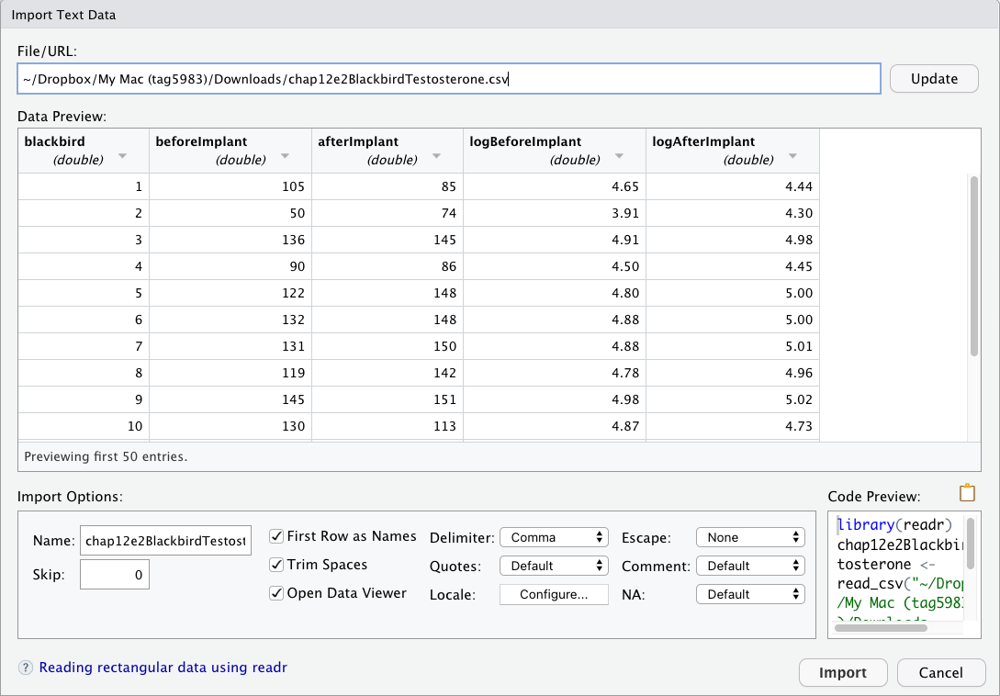
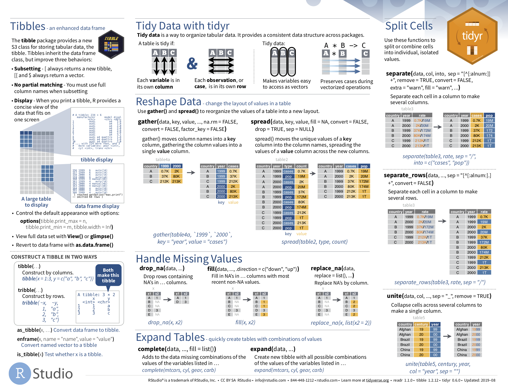

# Data Importing and "Tidy" Data {#tidy}

```{r setup_tidy, include=FALSE, purl=FALSE}
# Used to define Learning Check numbers:
chap <- 4
lc <- 0

# Set R code chunk defaults:
opts_chunk$set(
  echo = TRUE,
  eval = TRUE,
  warning = FALSE,
  message = TRUE,
  tidy = FALSE,
  purl = TRUE,
  out.width = "\\textwidth",
  fig.height = 4,
  fig.align = "center"
)

# Set output digit precision
options(scipen = 99, digits = 3)

# In kable printing replace all NA's with blanks
options(knitr.kable.NA = "")

# Set random number generator see value for replicable pseudorandomness.
set.seed(76)
```
<!-- Correct text and @ref in this paragraph
In Subsection \@ref(programming-concepts), we introduced the concept of a \index{data frame} data frame in R: a rectangular spreadsheet-like representation of data where the rows correspond to observations and the columns correspond to variables describing each observation.  In Section \@ref(WeightLoss), we started exploring our first data frame: the `WeightLoss` data frame included in the `WeightLoss` package. In Chapter \@ref(viz), we created visualizations based on the data included in `WeightLoss` and other data frames such as `weather`. In Chapter \@ref(wrangling), we learned how to take existing data frames and transform/modify them to suit our ends. 
-->
In this final chapter of the "Data Science with `tidyverse`" portion of the book, we extend some of these ideas by discussing a type of data formatting called "tidy" data. You will see that having data stored in "tidy" format is about more than just what the everyday definition of the term "tidy" might suggest: having your data "neatly organized." Instead, we define the term "tidy" as it's used by data scientists who use R, outlining a set of rules by which data is saved.

Knowledge of this type of data formatting was not necessary for our treatment of data visualization in Chapter \@ref(viz) and data wrangling in Chapter \@ref(wrangling). This is because all the data used were already in "tidy" format. In this chapter, we'll now see that this format is essential to using the tools we covered up until now. Furthermore, it will also be useful for all subsequent chapters in this book when we cover regression and statistical inference. First, however, we'll show you how to import spreadsheet data in R.

### Needed packages {-#tidy-packages}

Let's load all the packages needed for this chapter (this assumes you've already installed them). If needed, read Section \@ref(packages) for information on how to install and load R packages.

```{r message=FALSE}
library(dplyr)
library(ggplot2)
library(readr)
library(tidyr)
library(carData)
library(fivethirtyeight)
```

```{r message=FALSE, echo=FALSE, purl=FALSE}
# Packages needed internally, but not in text.
library(kableExtra)
library(stringr)
library(scales)
```


## Importing data {#csv}

Up to this point, we've almost entirely used data stored inside of an R package. Say instead you have your own data saved on your computer or somewhere online. How can you analyze this data in R? Spreadsheet data is often saved in one of the following three formats:

First, a *Comma Separated Values* `.csv` \index{CSV file} file.  You can think of a `.csv` file as a bare-bones spreadsheet where:

* Each line in the file corresponds to one row of data/one observation.
* Values for each line are separated with commas. In other words, the values of different variables are separated by commas in each row.
* The first line is often, but not always, a *header* row indicating the names of the columns/variables.

Second, an Excel `.xlsx` spreadsheet file. This format is based on Microsoft's proprietary Excel software. As opposed to bare-bones `.csv` files, `.xlsx` Excel files contain a lot of meta-data\index{meta-data} (data about data). Recall we saw a previous example of meta-data in Section \@ref(groupby) when adding "group structure" meta-data to a data frame by using the `group_by()` verb. Some examples of Excel spreadsheet meta-data include the use of bold and italic fonts, colored cells, different column widths, and formula macros.

Third, a [Google Sheets](https://www.google.com/sheets/about/) file, which is a "cloud" or online-based way to work with a spreadsheet. Google Sheets allows you to download your data in both comma separated values `.csv` and Excel `.xlsx` formats. One way to import Google Sheets data in R is to go to the Google Sheets menu bar -> File -> Download as -> Select "Microsoft Excel" or "Comma-separated values" and then load that data into R. A more advanced way to import Google Sheets data in R is by using the [`googlesheets`](https://cran.r-project.org/web/packages/googlesheets/vignettes/basic-usage.html) package, a method we leave to a more advanced data science book.

We'll cover two methods for importing `.csv` and `.xlsx` spreadsheet data in R: one using the console and the other using RStudio's graphical user interface, abbreviated as "GUI."

### Using the console

First, let's import a Comma Separated Values `.csv` file that exists on the internet. The `.csv` file `chap12e2BlackbirdTestosterone.csv` compares the humoral immunocompetence, measured as secondary antibody production to a protein antigen, of red-winged blackbirds before and after testosterone implants, as described in  Hasselquist, D., J. A. Marsh, P. W. Sherman, and J. C. Wingfield. 1999. Behavioral Ecology and Sociobiology 45: 167–175.	Let's use the `read_csv()` function from the `readr` \index{R packages!readr!read\_csv()} [@R-readr] package to read the dataset from the *Analysis of Biological Data* textbook website, import it into R, and save it in a data frame called `blackbird`.

```{r message=FALSE, eval=FALSE}
library(readr)
blackbird <- read_csv("http://www.zoology.ubc.ca/~schluter/WhitlockSchluter/wp-content/data/chapter12/chap12e2BlackbirdTestosterone.csv")
```

```{r message=FALSE, echo=FALSE, purl=FALSE}
blackbird <- read_csv("http://www.zoology.ubc.ca/~schluter/WhitlockSchluter/wp-content/data/chapter12/chap12e2BlackbirdTestosterone.csv")
# blackbird
```
<!-- UPDATE this paragraph
In this `blackbird` data frame, the minimum value of `-10` corresponds to a highly autocratic nation, whereas a value of `10` corresponds to a highly democratic nation. Note also that backticks surround the different variable names.  Variable names in R by default are not allowed to start with a number nor include spaces, but we can get around this fact by surrounding the column name with backticks. We'll revisit the `blackbird` data frame in a case study in the upcoming Section \@ref(case-study-tidy).
-->
Note that the `read_csv()` function included in the `readr` package is different than the `read.csv()` function that comes installed with R. While the difference in the names might seem trivial (an `_` instead of a `.`), the `read_csv()` function is, in our opinion, easier to use since it can more easily read data off the web and generally imports data at a much faster speed. Furthermore, the `read_csv()` function included in the `readr` saves data frames as `tibbles` by default. 


### Using RStudio's interface

Let's read in the exact same data, but this time from a file saved on your computer. Furthermore, we'll do this using RStudio's graphical interface instead of running `read_csv()` in the console. First, download the  file `chap12e2BlackbirdTestosterone.csv` by going to <a href="http://www.zoology.ubc.ca/~schluter/WhitlockSchluter/wp-content/data/chapter12/chap12e2BlackbirdTestosterone.csv" download>http://www.zoology.ubc.ca/~schluter/WhitlockSchluter/wp-content/data/chapter12/chap12e2BlackbirdTestosterone.csv</a>, then

1. Go to the Files pane of RStudio.
2. Navigate to the directory (i.e., folder on your computer) where the downloaded `chap12e2BlackbirdTestosterone.csv` file is saved. For example, this might be in your Downloads folder.
3. Click on `chap12e2BlackbirdTestosterone.csv`.
4. Click "Import Dataset..." 

At this point, you should see a screen pop-up like in Figure \@ref(fig:read-excel). After clicking on the "Import" \index{RStudio!import data} button on the bottom right of Figure \@ref(fig:read-excel), RStudio will save this spreadsheet's data in a data frame called `chap12e2BlackbirdTestosterone` and display its contents in the spreadsheet viewer. 

```{r read-excel, echo=FALSE, fig.cap="Importing an Excel file to R.", purl=FALSE}

```

Furthermore, note the "Code Preview" block in the bottom right of Figure \@ref(fig:read-excel). You can copy and paste this code to reload your data again later programmatically, instead of repeating this manual point-and-click process.


## "Tidy" data {#tidy-data-ex}
Let's now switch gears and learn about the concept of "tidy" data format with a motivating example from the `fivethirtyeight` package. The `fivethirtyeight` package [@R-fivethirtyeight] provides access to the datasets used in many articles published by the data journalism website, [FiveThirtyEight.com](https://fivethirtyeight.com/). For a complete list of all `r nrow(data(package = "fivethirtyeight")[[3]])` datasets included in the `fivethirtyeight` package, check out the package webpage by going to: <https://fivethirtyeight-r.netlify.app/articles/fivethirtyeight.html>.\index{R packages!fivethirtyeight}

Let's focus our attention on the `drinks` data frame and look at its first 5 rows:

```{r, echo=FALSE, purl=FALSE}
drinks %>%
  head(5)
```

After reading the help file by running `?drinks`, you'll see that `drinks` is a data frame containing results from a survey of the average number of servings of beer, spirits, and wine consumed in `r drinks %>% nrow()` countries. This data was originally reported on FiveThirtyEight.com in Mona Chalabi's article: ["Dear Mona Followup: Where Do People Drink The Most Beer, Wine And Spirits?"](https://fivethirtyeight.com/features/dear-mona-followup-where-do-people-drink-the-most-beer-wine-and-spirits/).

Let's apply some of the data wrangling verbs we learned in Chapter \@ref(wrangling) on the `drinks` data frame:

1. `filter()` the `drinks` data frame to only consider 4 countries: the United States, China, Italy, and Saudi Arabia, *then*
1. `select()` all columns except `total_litres_of_pure_alcohol` by using the `-` sign, *then*
1. `rename()` the variables `beer_servings`, `spirit_servings`, and `wine_servings` to `beer`, `spirit`, and `wine`, respectively.

and save the resulting data frame in `drinks_smaller`:

```{r}
drinks_smaller <- drinks %>% 
  filter(country %in% c("USA", "China", "Italy", "Saudi Arabia")) %>% 
  select(-total_litres_of_pure_alcohol) %>% 
  rename(beer = beer_servings, spirit = spirit_servings, wine = wine_servings)
drinks_smaller
```

Let's now ask ourselves a question: "Using the `drinks_smaller` data frame, how would we create the side-by-side barplot in Figure \@ref(fig:drinks-smaller)?". Recall we saw barplots displaying two categorical variables in Subsection \@ref(two-categ-barplot).

```{r drinks-smaller, fig.cap="Comparing alcohol consumption in 4 countries.", fig.height=3.9, echo=FALSE, purl=FALSE}
drinks_smaller_tidy <- drinks_smaller %>%
  gather(type, servings, -country)
drinks_smaller_tidy_plot <- ggplot(
  drinks_smaller_tidy,
  aes(x = country, y = servings, fill = type)
) +
  geom_col(position = "dodge") +
  labs(x = "country", y = "servings")
if (is_html_output()) {
  drinks_smaller_tidy_plot
} else {
  drinks_smaller_tidy_plot + scale_fill_grey()
}
```

Let's break down the grammar of graphics we introduced in Section \@ref(grammarofgraphics):

1. The categorical variable `country` with four levels (China, Italy, Saudi Arabia, USA) would have to be mapped to the `x`-position of the bars.
1. The numerical variable `servings` would have to be mapped to the `y`-position of the bars (the height of the bars).
1. The categorical variable `type` with three levels (beer, spirit, wine) would have to be mapped to the `fill` color of the bars.

Observe that `drinks_smaller` has three separate variables `beer`, `spirit`, and `wine`.  In order to use the `ggplot()` function to recreate the barplot in Figure \@ref(fig:drinks-smaller) however, we need a *single variable* `type` with three possible values: `beer`, `spirit`, and `wine`.  We could then map this `type` variable to the `fill` aesthetic of our plot.  In other words, to recreate the barplot in Figure \@ref(fig:drinks-smaller), our data frame would have to look like this:

```{r, purl=FALSE}
drinks_smaller_tidy
```

```{r echo=FALSE, purl=FALSE}
# This redundant code is used for dynamic non-static in-line text output purposes
n_row_drinks <- drinks_smaller_tidy %>% nrow()
n_alcohol_types <- drinks_smaller_tidy %>%
  select(type) %>%
  n_distinct()
n_countries <- drinks_smaller_tidy %>%
  select(country) %>%
  n_distinct()
```

Observe that while `drinks_smaller` and `drinks_smaller_tidy` are both rectangular in shape and contain the same `r n_row_drinks` numerical values (`r n_alcohol_types` alcohol types by `r n_countries` countries), they are formatted differently. `drinks_smaller` is formatted in what's known as \index{wide data format} ["wide"](https://en.wikipedia.org/wiki/Wide_and_narrow_data) format, whereas `drinks_smaller_tidy` is formatted in what's known as ["long/narrow"](https://en.wikipedia.org/wiki/Wide_and_narrow_data#Narrow) format.

In the context of doing data science in R, long/narrow format \index{long data format} is also known as "tidy" format. In order to use the `ggplot2` and `dplyr` packages for data visualization and data wrangling, your input data frames *must* be in "tidy" format. Thus, all non-"tidy" data must be converted to "tidy" format first. Before we convert non-"tidy" data frames like `drinks_smaller` to "tidy" data frames like `drinks_smaller_tidy`, let's define "tidy" data.


### Definition of "tidy" data {#tidy-definition}

You have surely heard the word "tidy" in your life:

* "Tidy up your room!"
* "Write your homework in a tidy way so it is easier to provide feedback."
* Marie Kondo's best-selling book, [_The Life-Changing Magic of Tidying Up: The Japanese Art of Decluttering and Organizing_](https://www.powells.com/book/-9781607747307), and Netflix TV series [_Tidying Up with Marie Kondo_](https://www.netflix.com/title/80209379).
* "I am not by any stretch of the imagination a tidy person, and the piles of unread books on the coffee table and by my bed have a plaintive, pleading quality to me - 'Read me, please!'" - Linda Grant

What does it mean for your data to be "tidy"? While "tidy" has a clear English meaning of "organized," the word "tidy" in data science using R means that your data follows a standardized format. We will follow Hadley Wickham's \index{Wickham, Hadley} definition of *"tidy" data* \index{tidy data} [@tidy] shown also in Figure \@ref(fig:tidyfig):

> A *dataset* is a collection of values, usually either numbers (if quantitative) or strings AKA text data (if qualitative/categorical). Values are organised in two ways. Every value belongs to a variable and an observation. A variable contains all values that measure the same underlying attribute (like height, temperature, duration) across units. An observation contains all values measured on the same unit (like a person, or a day, or a city) across attributes.
> 
> "Tidy" data is a standard way of mapping the meaning of a dataset to its structure. A dataset is messy or tidy depending on how rows, columns and tables are matched up with observations, variables and types. In *tidy data*:
>
> 1. Each variable forms a column.
> 2. Each observation forms a row.
> 3. Each type of observational unit forms a table.

(ref:tidy-r4ds) Tidy data graphic from *R for Data Science*.

```{r tidyfig, echo=FALSE, fig.cap="(ref:tidy-r4ds)", out.height="80%", out.width="80%", purl=FALSE}
include_graphics("images/r4ds/tidy-1.png")
```

For example, say you have the following table of chick weights (in g) in Table \@ref(tab:non-tidy-stocks):

```{r non-tidy-stocks, echo=FALSE, purl=FALSE}
stocks <- tibble(
  Date = as.Date("2009-01-01") + 0:4,
  `Chick 1 weight` = paste(c("173.55", "172.61", "173.86", "170.77", "174.29"),"g", sep = " "),
  `Chick 2 weight` = paste(c("174.90", "171.42", "171.58", "173.89", "170.16"),"g", sep = " "),
  `Chick 3 weight` = paste(c("174.34", "170.04", "173.65", "174.87", "172.19"), "g", sep = " ")
) %>%
  slice(1:2)
stocks %>%
  kable(
    digits = 2,
    caption = "Chick weights (non-tidy format)",
    booktabs = TRUE,
    linesep = ""
  ) %>%
  kable_styling(
    font_size = ifelse(is_latex_output(), 10, 16),
    latex_options = c("hold_position")
  )
```

Although the data are neatly organized in a rectangular spreadsheet-type format, they do not follow the definition of data in "tidy" format. While there are three variables corresponding to three unique pieces of information (date, chick ID, and weight), there are not three columns. In "tidy" data format, each variable should be its own column, as shown in Table \@ref(tab:tidy-stocks). Notice that both tables present the same information, but in different formats. 

```{r tidy-stocks, echo=FALSE, purl=FALSE}
stocks_tidy <- stocks %>%
  rename(
    `1` = `Chick 1 weight`,
    `2` = `Chick 2 weight`,
    `3` = `Chick 3 weight`,
  ) %>%
  #  gather(`Stock name`, `Stock price`, -Date)
  pivot_longer(
    cols = -Date,
    names_to = "Chick ID",
    values_to = "Weight"
  )
stocks_tidy %>%
  kable(
    digits = 2,
    caption = "Chick weights (tidy format)",
    booktabs = TRUE,
    linesep = ""
  ) %>%
  kable_styling(
    font_size = ifelse(is_latex_output(), 10, 16),
    latex_options = c("hold_position")
  )
```

Now we have the requisite three columns Date, Chick ID, and Weight. On the other hand, consider the data in Table \@ref(tab:tidy-stocks-2).

```{r tidy-stocks-2, echo=FALSE, purl=FALSE}
stocks <- tibble(
  Date = as.Date("2009-01-01") + 0:4,
  `Chick 1 weight` = paste(c("173.55", "172.61", "173.86", "170.77", "174.29"),"g", sep = " "),
  `Weather` = c("Sunny", "Overcast", "Rain", "Rain", "Sunny")
) %>%
  slice(1:2)
stocks %>%
  kable(
    digits = 2,
    caption = "Example of tidy data" # ,
    #    booktabs = TRUE
  ) %>%
  kable_styling(
    font_size = ifelse(is_latex_output(), 10, 16),
    latex_options = c("hold_position")
  )
```

In this case, even though the variable "Chick 1 weight" occurs just like in our non-"tidy" data in Table \@ref(tab:non-tidy-stocks), the data *is* "tidy" since there are three variables corresponding to three unique pieces of information: Date, Chick 1 weight, and the Weather that particular day.

```{block, type="learncheck", purl=FALSE}
\vspace{-0.15in}
**_Learning check_**
\vspace{-0.1in}
```

**`r paste0("(LC", chap, ".", (lc <- lc + 1), ")")`** What are common characteristics of "tidy" data frames?

**`r paste0("(LC", chap, ".", (lc <- lc + 1), ")")`** What makes "tidy" data frames useful for organizing data?

```{block, type="learncheck", purl=FALSE}
\vspace{-0.25in}
\vspace{-0.25in}
```


### Converting to "tidy" data

In this book so far, you've only seen data frames that were already in "tidy" format. Furthermore, for the rest of this book, you'll mostly only see data frames that are already in "tidy" format as well. This is not always the case however with all datasets in the world. If your original data frame is in wide (non-"tidy") format and you would like to use the `ggplot2` or `dplyr` packages, you will first have to convert it to "tidy" format. To do so, we recommend using the \index{tidyr!pivot\_longer()} `pivot_longer()` function in the `tidyr` \index{R packages!tidyr} package [@R-tidyr]. 

Going back to our `drinks_smaller` data frame from earlier:

```{r}
drinks_smaller
```

We convert it to "tidy" format by using the `pivot_longer()` function from the `tidyr` package as follows:

```{r}
drinks_smaller_tidy <- drinks_smaller %>% 
  pivot_longer(names_to = "type", 
               values_to = "servings", 
               cols = -country)
drinks_smaller_tidy
```

We set the arguments to `pivot_longer()` as follows:

1. `names_to` here corresponds to the name of the variable in the new "tidy"/long data frame that will contain the *column names* of the original data. Observe how we set `names_to = "type"`. In the resulting `drinks_smaller_tidy`, the column `type` contains the three types of alcohol `beer`, `spirit`, and `wine`. Since `type` is a variable name that doesn't appear in `drinks_smaller`, we use quotation marks around it. You'll receive an error if you just use `names_to = type` here.
1. `values_to` here is the name of the variable in the new "tidy" data frame that will contain the *values* of the original data. Observe how we set `values_to = "servings"` since each of the numeric values in each of the `beer`, `wine`, and `spirit` columns of the `drinks_smaller` data corresponds to a value of `servings`. In the resulting `drinks_smaller_tidy`, the column `servings` contains the `r n_countries` $\times$ `r n_alcohol_types` = `r n_row_drinks` numerical values. Note again that `servings` doesn't appear as a variable in `drinks_smaller` so it again needs quotation marks around it for the `values_to` argument.
1. The third argument `cols` is the columns in the `drinks_smaller` data frame you either want to or don't want to "tidy." Observe how we set this to `-country` indicating that we don't want to "tidy" the `country` variable in `drinks_smaller` and rather only `beer`, `spirit`, and `wine`. Since `country` is a column that appears in `drinks_smaller` we don't put quotation marks around it.

The third argument here of `cols` is a little nuanced, so let's consider code that's written slightly differently but that produces the same output: 

```{r, eval=FALSE}
drinks_smaller %>% 
  pivot_longer(names_to = "type", 
               values_to = "servings", 
               cols = c(beer, spirit, wine))
```

Note that the third argument now specifies which columns we want to "tidy" with `c(beer, spirit, wine)`, instead of the columns we don't want to "tidy" using `-country`. We use the `c()` function to create a vector of the columns in `drinks_smaller` that we'd like to "tidy." Note that since these three columns appear one after another in the `drinks_smaller` data frame, we could also do the following for the `cols` argument:

```{r, eval=FALSE}
drinks_smaller %>% 
  pivot_longer(names_to = "type", 
               values_to = "servings", 
               cols = beer:wine)
```

With our `drinks_smaller_tidy` "tidy" formatted data frame, we can now produce the barplot you saw in Figure  \@ref(fig:drinks-smaller) using `geom_col()`. This is done in Figure \@ref(fig:drinks-smaller-tidy-barplot). Recall from Section \@ref(geombar) on barplots that we use `geom_col()` and not `geom_bar()`, since we would like to map the "pre-counted" `servings` variable to the `y`-aesthetic of the bars.

```{r eval=FALSE}
ggplot(drinks_smaller_tidy, aes(x = country, y = servings, fill = type)) +
  geom_col(position = "dodge")
```

(ref:drinks-col) Comparing alcohol consumption in `r n_countries` countries using geom_col().

```{r drinks-smaller-tidy-barplot, echo=FALSE, fig.cap="(ref:drinks-col)", fig.height=2.5, purl=FALSE}
if (is_html_output()) {
  drinks_smaller_tidy_plot
} else {
  drinks_smaller_tidy_plot + scale_fill_grey()
}
```

Converting "wide" format data to "tidy" format often confuses new R users. The only way to learn to get comfortable with the `pivot_longer()` function is with practice, practice, and more practice using different datasets. For example, run `?pivot_longer` and look at the examples in the bottom of the help file. We'll show another example of using `pivot_longer()` to convert a "wide" formatted data frame to "tidy" format in Section \@ref(case-study-tidy). 

If however you want to convert a "tidy" data frame to "wide" format, you will need to use the `pivot_wider()`\index{tidyr!pivot\_wider()} function instead. Run `?pivot_wider` and look at the examples in the bottom of the help file for examples.

You can also view examples of both `pivot_longer()` and `pivot_wider()` on the [tidyverse.org](https://tidyr.tidyverse.org/dev/articles/pivot.html#pew) webpage. There's a nice example to check out the different functions available for data tidying and a case study using data from the World Health Organization on that webpage. Furthermore, each week the R4DS Online Learning Community posts a dataset in the weekly [`#`TidyTuesday event](https://github.com/rfordatascience/tidytuesday) that might serve as a nice place for you to find other data to explore and transform. 

```{block, type="learncheck", purl=FALSE}
\vspace{-0.15in}
**_Learning check_**
\vspace{-0.1in}
```

**`r paste0("(LC", chap, ".", (lc <- lc + 1), ")")`** Take a look again at the `blackbird` data frame that you imported earlier. Run the following:

```{r, eval=FALSE, purl=FALSE}
blackbird
```

As mentioned earlier, `blackbird` is a data frame containing information that compares the immunocompetence of red-winged blackbirds before and after testosterone implants. For simplicity, let's ignore the last two columns, which are the log-transformed values of the data in the previous two columns:

```{r}
blackbird_smaller <- blackbird %>% 
  select(!starts_with("log"))
blackbird_smaller
```

This data frame is not in "tidy" format. How would you convert this data frame to be in "tidy" format, so that it has a variable `Time_Period` indicating the time period (before or after implant) and a variable `Measurement` of the immunocompetence level?

```{block, type="learncheck", purl=FALSE}
\vspace{-0.25in}
\vspace{-0.25in}
```


## Case study: Weight loss data {#case-study-tidy}

In this section, we'll show you another example of how to convert a data frame that isn't in "tidy" format ("wide" format) to a data frame that is in "tidy" format ("long/narrow" format). We'll do this using the `pivot_longer()` function from the `tidyr` package again. 

Furthermore, we'll make use of functions from the `ggplot2` and `dplyr` packages to produce a *time-series plot* showing weight loss data for three groups of individuals: control, diet, and diet plus exercise. Recall that we saw time-series plots in Section \@ref(linegraphs) on creating linegraphs using `geom_line()`. 

We'll summarize the `WeightLoss` data frame available in the `carData` package and focus on average weight loss data for the `Control` group. 

```{r}
ControlGroup <- WeightLoss %>% 
  group_by(group) %>% 
  summarise(mean_wl1 = mean(wl1), 
            mean_wl2 = mean(wl2), 
            mean_wl3 = mean(wl3)) %>% 
  filter(group == "Control") 
ControlGroup
```

Now, let's lay out the grammar of graphics we saw in Section \@ref(grammarofgraphics). 

First we know we need to set `data = ControlGroup` and use a `geom_line()` layer, but what is the aesthetic mapping of variables? We'd like to see how the weight loss has changed over the months, so we need to map:

* `month` to the x-position aesthetic and
* `weightloss` to the y-position aesthetic

Now we are stuck in a predicament, much like with our `drinks_smaller` example in Section \@ref(tidy-data-ex). <!--We see that we have a variable named `group`, but its only value is `"Control"`.  We have other variables for monthly weight loss denoted by different `wl` values.-->  Unfortunately, the `ControlGroup` data frame is not "tidy" and hence is not in the appropriate format to apply the grammar of graphics, and thus we cannot use the `ggplot2` package just yet.  

We need to take the values of the columns corresponding to average monthly weight loss (`mean_wl`) in `ControlGroup` and convert them into a new "names" variable called `month`. Because we want these values to count time (in months) for the line graph, below we first rename the variables as integers. Note that backticks (just above the 'tab' key on most keyboards) surround these variable names.  By default, variable names in R are not allowed to start with a number nor include spaces, but we can get around this by surrounding the column name with backticks.

Then, we need to take the average weight loss values in the inside of the data frame and turn them into a new "values" variable called `weightloss`. Our resulting data frame will have three columns:  `group`, `month`, and `weightloss`. Recall that the `pivot_longer()` function in the `tidyr` package does this for us:

```{r}
ControlGroup_tidy <- ControlGroup %>% 
  rename(`1` = mean_wl1, `2` = mean_wl2, `3` = mean_wl3) %>% 
  pivot_longer(names_to = "month", 
               values_to = "weightloss", 
               cols = -group,
               names_transform = list(month = as.integer)) 
ControlGroup_tidy
```

1. `names_to` is the name of the variable in the new "tidy" data frame that will contain the *column names* of the original data. Observe how we set `names_to = "month"`.  In the resulting `ControlGroup_tidy`, the column `month` indicates the month that the weight loss was measured.
1. `values_to` is the name of the variable in the new "tidy" data frame that will contain the *values* of the original data. Observe how we set `values_to = "weightloss"`. In the resulting `ControlGroup_tidy` the column `weightloss` contains the 1 $\times$ 3 = 3 weight loss scores as numeric values.
1. The third argument is the columns you either want to or don't want to "tidy." Observe how we set this to `cols = -group` indicating that we don't want to "tidy" the `group` variable in `ControlGroup` and rather only variables `1` through `3`. 
1. The last argument of `names_transform` tells R what type of variable `year` should be set to. Without specifying that it is an `integer` as we've done here, `pivot_longer()` will set it to be a character value by default.

We can now create the time-series plot in Figure \@ref(fig:guat-dem-tidy) to visualize how weight loss scores in the Control group have changed during the study using a \index{ggplot2!geom\_line()} `geom_line()`. Furthermore, we'll use the `labs()` function in the `ggplot2` package to add informative labels to all the `aes()`thetic attributes of our plot, in this case the `x` and `y` positions.

```{r guat-dem-tidy, fig.cap="Weight loss scores of control group.", fig.height=3}
ggplot(ControlGroup_tidy, aes(x = month, y = weightloss)) +
  geom_line() +
  labs(x = "Month", y = "Weight Loss Score")
```

Note that if we forgot to include the `names_transform` argument specifying that `year` was not of character format, we would have gotten an error here since `geom_line()` wouldn't have known how to sort the character values in `month` in the right order. 

```{block lc-tidying, type="learncheck", purl=FALSE}
\vspace{-0.15in}
**_Learning check_**
\vspace{-0.1in}
```

**`r paste0("(LC", chap, ".", (lc <- lc + 1), ")")`**  Read in the life expectancy data stored at <https://moderndive.com/data/le_mess.csv> and convert it to a "tidy" data frame. 

**`r paste0("(LC", chap, ".", (lc <- lc + 1), ")")`**  Prepare line graphs displaying the average weight loss scores with time for all three groups using facets or different colored lines for each group.  

```{block, type="learncheck", purl=FALSE}
\vspace{-0.25in}
\vspace{-0.25in}
```


## `tidyverse` package {#tidyverse-package}

Notice at the beginning of the chapter we loaded the following four packages, which are among four of the most frequently used R packages for data science:

```{r, eval=FALSE, purl=FALSE}
library(ggplot2)
library(dplyr)
library(readr)
library(tidyr)
```

Recall that `ggplot2` is for data visualization, `dplyr` is for data wrangling, `readr` is for importing spreadsheet data into R, and `tidyr` is for converting data to "tidy" format. There is a much quicker way to load these packages than by individually loading them: by installing and loading the `tidyverse` package. The `tidyverse` package acts as an "umbrella" package whereby installing/loading it will install/load multiple packages at once for you. 

After installing the `tidyverse` package as you would a normal package as seen in Section \@ref(packages), running:

```{r, eval=FALSE, purl=FALSE}
library(tidyverse)
```

would be the same as running:

```{r, eval=FALSE, purl=FALSE}
library(ggplot2)
library(dplyr)
library(readr)
library(tidyr)
library(purrr)
library(tibble)
library(stringr)
library(forcats)
```

The `purrr`, `tibble`, `stringr`, and `forcats` are left for a more advanced book; check out [*R for Data Science*](http://r4ds.had.co.nz/) to learn about these packages.

For the remainder of this book, we'll start every chapter by running `library(tidyverse)`, instead of loading the various component packages individually. The `tidyverse` "umbrella" package gets its name from the fact that all the functions in all its packages are designed to have common inputs and outputs: data frames are in "tidy" format. This standardization of input and output data frames makes transitions between different functions in the different packages as seamless as possible. For more information, check out the [tidyverse.org](https://www.tidyverse.org/) webpage for the package.


## Conclusion {#tidy-data-conclusion}

### Additional resources
<!--
```{r echo=FALSE, results="asis", purl=FALSE}
if (is_latex_output()) {
  cat("Solutions to all *Learning checks* can be found online in [Appendix D](https://moderndive.com/D-appendixD.html).")
}
```

```{r echo=FALSE, purl=FALSE, results="asis"}
generate_r_file_link("04-tidy.R")
```
-->

If you want to learn more about using the `readr` and `tidyr` package, we suggest that you check out RStudio's "Data Import Cheat Sheet." In the current version of RStudio in late 2019, you can access this cheatsheet by going to the RStudio Menu Bar -> Help -> Cheatsheets -> "Browse Cheatsheets" -> Scroll down the page to the "Data Import Cheat Sheet." The first page of this cheatsheet has information on using the `readr` package to import data, while the second page has information on using the `tidyr` package to "tidy" data. `r if(is_html_output()) "You can see a preview of both cheatsheets in the figures below."`

```{r import-cheatsheet, echo=FALSE, fig.cap="Data Import cheatsheet (first page): readr package.", out.width="66%", purl=FALSE}
if (is_html_output()) {
  include_graphics("images/cheatsheets/data-import-1.png")
}
```

```{r tidyr-cheatsheet, echo=FALSE, fig.cap="Data Import cheatsheet (second page): tidyr package.", out.width="66%", purl=FALSE}
if (is_html_output()) {
  
}
```


### What's to come?

Congratulations! You've completed the "Data Science with `tidyverse`" portion of this book. We'll now move to the "Statistical Inference with `infer`" portion of this book. Statistical inference is the science of inferring about some unknown quantity using sampling.

The most well-known examples of sampling in practice involve *polls*. Because asking an entire population about their opinions would be a long and arduous task, pollsters often take a smaller sample that is hopefully representative of the population. Based on the results of this sample, pollsters hope to make claims about the entire population. 

As shown in Figure \@ref(fig:part2), once we've covered Chapter \@ref(sampling) on sampling, we'll examine confidence intervals in Chapter \@ref(confidence-intervals) and hypothesis testing in Chapter \@ref(hypothesis-testing).

(ref:flowchart-partii) *ModernDive for Life Scientists* flowchart - on to Part II!

```{r part2, echo=FALSE, fig.cap="(ref:flowchart-partii)", fig.height=5.5, purl=FALSE}
include_graphics("images/flowcharts/flowchart/flowchart_ModDiveLifeSci_03.png")
```
