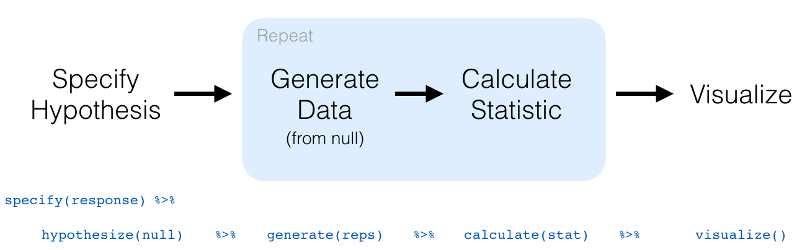
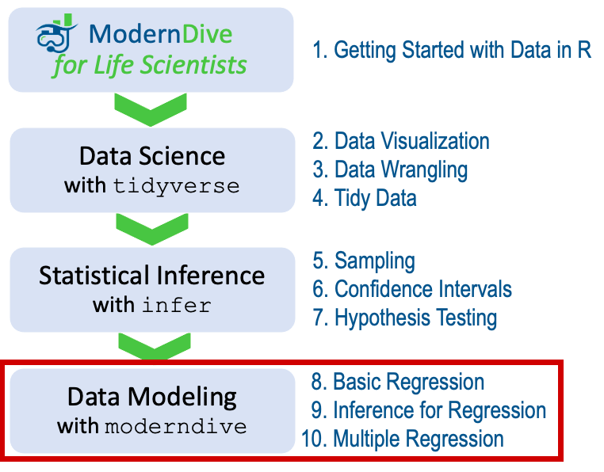

# Hypothesis Testing {#hypothesis-testing}  
    
```{r setup_hypo, include=FALSE, purl=FALSE}
# Used to define Learning Check numbers:
chap <- 7
lc <- 0

# Set R code chunk defaults:
opts_chunk$set(
  echo = TRUE,
  eval = TRUE,
  warning = FALSE,
  message = TRUE,
  tidy = FALSE,
  purl = TRUE,
  out.width = "\\textwidth",
  fig.height = 4,
  fig.align = "center"
)

# Set output digit precision
options(scipen = 99) # , digits = 3)

# Set random number generator seed value for replicable pseudorandomness.
set.seed(76)
```

Now that we've studied confidence intervals in Chapter \@ref(confidence-intervals), let's study another commonly used method for statistical inference: hypothesis testing. Hypothesis tests allow us to take a sample of data from a population and infer about the plausibility of competing hypotheses. For example, in the upcoming "clutch size" example in Section \@ref(ht-activity), you'll study the data collected from a study to investigate whether their was an association between egg production and a female's susceptibility to parasites. 

The good news is we've already covered many of the necessary concepts to understand hypothesis testing in Chapters \@ref(sampling) and \@ref(confidence-intervals). We will expand further on these ideas here and also provide a general framework for understanding hypothesis tests. By understanding this general framework, you'll be able to adapt it to many different scenarios.

The same can be said for confidence intervals. There was one general framework that applies to *all* confidence intervals and the `infer` package was designed around this framework. While the specifics may change slightly for different types of confidence intervals, the general framework stays the same. 

We believe that this approach is much better for long-term learning than focusing on specific details for specific confidence intervals using theory-based approaches. As you'll now see, we prefer this general framework for hypothesis tests as well.

```{r appendixb, echo=FALSE, results="asis", purl=FALSE}
if (!is_latex_output()) {
  cat("If you'd like more practice or you're curious to see how this framework applies to different scenarios, you can find fully-worked out examples for many common hypothesis tests and their corresponding confidence intervals in Appendix B. ")
  cat("We recommend that you carefully review these examples as they also cover how the general frameworks apply to traditional theory-based methods like the $t$-test and normal-theory confidence intervals.  You'll see there that these traditional methods are just approximations for the computer-based methods we've been focusing on. However, they also require conditions to be met for their results to be valid. Computer-based methods using randomization, simulation, and bootstrapping have much fewer restrictions. Furthermore, they help develop your computational thinking, which is one big reason they are emphasized throughout this book.")
}
```

```{block loa7, type="review", purl=FALSE}
\vspace{-0.15in}

**_Chapter Learning Objectives_**

*At the end of this chapter, you should be able to…*   
• State useful null and alternative statistical hypotheses.  
• Perform hypothesis testing in R using computer-based and theory-based methods.  
• Properly interpret p-values to reach statistical conclusions.  
\vspace{-0.1in}
```


### Needed packages {-#nhst-packages}

Let's load all the packages needed for this chapter (this assumes you've already installed them). Recall from our discussion in Section \@ref(tidyverse-package) that loading the `tidyverse` package by running `library(tidyverse)` loads the following commonly used data science packages all at once:

* `ggplot2` for data visualization
* `dplyr` for data wrangling
* `tidyr` for converting data to "tidy" format
* `readr` for importing spreadsheet data into R
* As well as the more advanced `purrr`, `tibble`, `stringr`, and `forcats` packages

Before you load the following packages, first check that they are installed by looking in RStudio's Packages tab. The `abd` package also requires the `lattice`, `grid`, `mosaic`, and `nlme` packages, so look for these too.  If any of the needed packages are missing, read Section \@ref(packages) for information on how to install R packages. 

```{r message=FALSE}
library(tidyverse)
library(infer)
library(moderndive)
library(abd)
library(ggmosaic)
```

```{r message=FALSE, echo=FALSE, purl=FALSE}
# Packages needed internally, but not in text.
library(kableExtra)
library(patchwork)
library(scales)
library(viridis)
library(ggrepel)
```


## Clutch size and malaria resistance {#ht-activity}

Let's begin with a study investigating if there is an association between susceptibility of birds to parasites following increased egg production. 


### Is there a tradeoff between reproduction and immune defense?

What limits the number of offspring that an individual can produce? One idea is that there is a trade-off between devoting resources to reproduction versus devoting resources to systems for self-preservation, including defenses against parasites and other pathogens. To test this idea, Oppliger et al. (1996) removed the first two eggs laid in half the nests of a breeding population of the bird species *Paus major*. To compensate, the females in these nests produced one more egg, on average, than females in the control group, whose nests were left intact.  Two weeks after egg hatching, the presence of malaria in each female parent was assessed. A summary of the results can be found in the `GreatTitMalaria` dataset of the `abd` package. Let's have a look.

```{r}
GreatTitMalaria
```

Let's perform an exploratory data analysis of the relationship between the two categorical variables malaria and `treatment`. Recall that we saw in Subsection \@ref(two-categ-barplot) that one way we can visualize such a relationship is by using a stacked barplot. 

```{r eval=FALSE}
ggplot(GreatTitMalaria, aes(x = treatment, fill = response)) +
  geom_bar() +
  labs(x = "Treatment")
```

```{r BirdMalaria-barplot, echo=FALSE, fig.cap="Barplot relating bird treatment to malaria infection.", purl=FALSE}
GreatTitMalaria_barplot <- ggplot(GreatTitMalaria, aes(x = treatment, fill = response)) +
  geom_bar() +
  labs(x = "Treatment")
if (is_html_output()) {
  GreatTitMalaria_barplot
} else {
  GreatTitMalaria_barplot + scale_fill_grey()
}
```

Observe in Figure \@ref(fig:BirdMalaria-barplot) that while some of the females on the control nests were infected with the malaria parasite, a greater fraction of females on the experimentally-manipulated nests were infected. 

Because of the difference in the number of females in the two treatment groups, it's a little difficult to compare the rates of infection. To see this better, let's introduce another type of plot called a mosaic plot, which uses `geom_mosaic()` from the `ggmosaic` package.

```{r eval=FALSE}
ggplot(GreatTitMalaria) +
  geom_mosaic(aes(x = product(treatment), 
                  fill = response)) +
  labs(x = "Treatment", y = "Relative frequency")
```

```{r BirdMalaria-mosaicplot, echo=FALSE, fig.cap="Mosaic plot relating bird treatment to frequency of malaria infection.", purl=FALSE}
GreatTitMalaria_mosaicplot <- ggplot(GreatTitMalaria) +
  geom_mosaic(aes(x = product(treatment), 
                  fill = response)) +
  labs(x = "Treatment", y = "Relative frequency")
if (is_html_output()) {
  GreatTitMalaria_mosaicplot
} else {
  GreatTitMalaria_mosaicplot + scale_fill_grey()
}
```

While the bars are also stacked in a mosaic plot, the width of each bar on the x-axis indicates the size of each group. Furthermore, proportions are displayed on the y-axis, rather than counts. In this mosaic plot, it's easier to see that a larger proportion of the experimentally treated females were infected with malaria compared to the control females.

```{r, echo=FALSE, purl=FALSE}
observed_test_statistic <- GreatTitMalaria %>%
  specify(response ~ treatment, success = "Malaria") %>%
  calculate(stat = "diff in props", order = c("Egg removal", "Control")) %>%
  pull(stat) %>%
  round(3)

# This code is used for dynamic non-static in-line text output purposes
total_C <- GreatTitMalaria %>% 
  filter(treatment=="Control") %>% nrow()
n_C_Mal <- GreatTitMalaria %>%
  filter(treatment == "Control" & response == "Malaria") %>%
  nrow()
p_C_Mal <- n_C_Mal / total_C
total_E <- GreatTitMalaria %>% 
  filter(treatment=="Egg removal") %>% nrow()
n_E_Mal <- GreatTitMalaria %>%
  filter(treatment == "Egg removal" & response == "Malaria") %>%
  nrow()
p_E_Mal <- (n_E_Mal / total_E) %>% round(3)
diff_prop0 <- p_E_Mal - p_C_Mal
total_birds <- total_C + total_E
```

To summarize, of the `r total_C` control females, `r n_C_Mal` became infected with the malaria parasite, for a proportion of `r n_C_Mal`/`r total_C` = `r p_C_Mal` = `r p_C_Mal*100`%. On the other hand, of the `r total_E` females in the experimental group, `r n_E_Mal` became infected with the malaria parasite, for a proportion of `r n_E_Mal`/`r total_E` = `r p_E_Mal` = `r p_E_Mal*100`%. Comparing these two rates of malaria parasite infection, it appears that experimentally-manipulated females were infected at a rate `r p_E_Mal` - `r p_C_Mal` = `r p_E_Mal - p_C_Mal` = `r (p_E_Mal - p_C_Mal)*100`% higher than control females. This is highly suggestive of an increased sensitivity of treated females to malaria infection. 

The question is, however, does this provide *conclusive* evidence that there is difference in susceptibility to parasite infection as a result of this experimental manipulation? Could a difference in infection rates of `r (p_E_Mal - p_C_Mal) * 100`% still occur by chance, even in a hypothetical world where egg removal didn't increase the risk of malaria infection? In other words, what is the role of *sampling variation* in this hypothesized world? To answer this question, we'll again rely on a computer to run *simulations*. 

### Shuffling once

To run the simulations, we will work with the original `GreatTitMalaria` dataset. To understand the probability of the observed results, first try to imagine a hypothetical universe where egg removal didn't affect the likelihood of a malaria infection. In such a hypothetical universe, the nest status of a female bird would have no bearing on their chances of becoming infected by a parasite. Bringing things back to our `GreatTitMalaria` data frame, the `treatment` variable would thus be an irrelevant label for predicting malaria infection. If these `treatment` labels were irrelevant, then we could randomly reassign them by "shuffling" them to no consequence!

To illustrate this idea, in Table \@ref(tab:compare-six) we narrow our focus to 6 arbitrarily chosen females of the `r total_birds` . The malaria column shows that 3 females were infected while 3 weren't. The `treatment` column shows the nest treatment, control or egg removal. 

However, in our hypothesized universe of no effect of egg removal, treatment is irrelevant and thus it is of no consequence to randomly "shuffle" the values of `treatment`. The `shuffled_treatment` column shows one such possible random shuffling. Observe in the last column how the number of females in the `Egg removal` group and the `Control` group  remains the same at 3 each, but they are now listed in a different order. 

```{r compare-six, echo=FALSE, purl=FALSE}
set.seed(16)
# Pick out 6 rows
GreatTitMalaria_sample <- GreatTitMalaria %>%
  slice(c(36, 39, 2, 22, 24, 55)) %>%
  mutate(`shuffled_treatment` = sample(treatment))

GreatTitMalaria_sample %>%
  kable(
    caption = "One example of shuffling treatment variable",
    booktabs = TRUE,
    longtable = TRUE,
    linesep = ""
  ) %>%
  kable_styling(
    font_size = ifelse(is_latex_output(), 10, 16),
    latex_options = c("hold_position", "repeat_header")
  )
```

Again, such random shuffling of the treatment label only makes sense in our hypothesized universe of no treatment effect. How could we extend this shuffling of the treatment variable to all `r total_birds` birds by hand? One way would be by using standard decks of playing cards, like the one displayed in Figure \@ref(fig:deck-of-cards).

```{r deck-of-cards, echo=FALSE, fig.cap="Standard deck of 52 playing cards.", purl=FALSE, out.width="100%"}
include_graphics("images/shutterstock/shutterstock_670789453.jpg")
```

In our shuffling simulation, we will start with `r total_C` red cards, the number of birds in the control group, and `r total_E` black cards, the number of birds in the egg removal group. After shuffling these `r total_birds` cards as seen in Figure \@ref(fig:shuffling), we can flip the cards over one-by-one, assigning `Control` to the `shuffled treatment` variable for each red card and `Egg removal` to the `shuffled treatment` variable for each black card.

```{r shuffling, echo=FALSE, fig.cap="Shuffling a deck of cards.", purl=FALSE, out.width="100%", out.height="100%"}
include_graphics("images/shutterstock/shutterstock_128283971.jpg")
```

We've saved one such shuffling in the `GreatTitMalaria_shuffled` data frame. If you compare the original `GreatTitMalaria` and the shuffled `GreatTitMalaria_shuffled` data frames, you'll see that while the malaria variable is identical, the `shuffled_treatment` variable differs from `treatment`. 

Let's repeat the same exploratory data analysis we did for the original `GreatTitMalaria` data on our `GreatTitMalaria_shuffled` data frame. Let's create a bar plot visualizing the relationship between malaria and the new shuffled `treatment` variable and compare this to the original unshuffled version in Figure \@ref(fig:BirdMalaria-barplot-permuted).

```{r, eval=FALSE}
ggplot(GreatTitMalaria_shuffled, 
       aes(x = shuffled_treatment, fill = response)) +
  geom_bar() + 
  labs(x = "Shuffled treatment")
```
```{r BirdMalaria-barplot-permuted, fig.cap="Barplots of relationship of response with treatment (left) and shuffled treatment (right).", fig.height=4.7, echo=FALSE, purl=FALSE}
GreatTitMalaria_shuffled <- GreatTitMalaria %>%
  mutate(`shuffled_treatment` = sample(treatment))
height1 <- GreatTitMalaria %>%
  group_by(treatment) %>%
  summarize(n = n()) %>%
  pull(n) %>%
  max()
height2 <- GreatTitMalaria_shuffled %>%
  group_by(shuffled_treatment) %>%
  summarize(n = n()) %>%
  pull(n) %>%
  max()
height <- max(height1, height2)

plot1 <- ggplot(GreatTitMalaria, aes(x = treatment, fill = response)) +
  geom_bar() +
  labs(x = "Treatment", title = "Original") +
  theme(legend.position = "none") +
  coord_cartesian(ylim = c(0, height))
plot2 <- ggplot(GreatTitMalaria_shuffled, aes(x = shuffled_treatment, fill = response)) +
  geom_bar() +
  labs(x = "Shuffled treatment", y = "", title = "Shuffled") +
  coord_cartesian(ylim = c(0, height))
if (is_html_output()) {
  plot1 + plot2
} else {
  (plot1 + scale_fill_grey()) + (plot2 + scale_fill_grey())
}
```

In the original data, in the left barplot, the rate of malaria (red) in females following egg removal is clearly much greater than the rate in control females. In comparison, with the new "shuffled" data visualized in the right barplot, the rates of malaria appear pretty similar between the females in the two groups.

Let's also compute the proportion of female birds with malaria for each `shuffled_treatment` group:

```{r}
GreatTitMalaria_shuffled %>% 
  group_by(shuffled_treatment, response) %>% 
  tally() # Same as summarize(n = n())
```
```{r, echo=FALSE, purl=FALSE}
# control stats
n_C_Mal <- GreatTitMalaria_shuffled %>%
  filter(response == "Malaria", shuffled_treatment == "Control") %>%
  nrow()
prop_C_Mal <- n_C_Mal / (total_C)

# egg removal stats
n_E_Mal <- GreatTitMalaria_shuffled %>%
  filter(response == "Malaria", 
         shuffled_treatment == "Egg removal") %>%
  nrow()
prop_E_Mal <- n_E_Mal / (total_E)

# diff
diff_propS <- round(prop_C_Mal - prop_E_Mal, 3)

# round proportions post difference
prop_C_Mal <- round(prop_C_Mal, 3)
prop_E_Mal <- round(prop_E_Mal, 3)
```

So in this hypothetical universe of no effect of egg removal, `r n_E_Mal`/`r total_E` = `r prop_E_Mal` = `r prop_E_Mal*100`% of females following egg removal became infected with malaria. On the other hand,  `r n_C_Mal`/`r total_C` = `r prop_C_Mal` = `r prop_C_Mal*100`% of control females became infected with malaria.

Let's next compare these two values. In this hypothetical universe of no effect of egg removal, it appears that females following egg removal were infected with malaria at a rate that was `r prop_E_Mal ` - `r prop_C_Mal ` = `r diff_propS` = `r diff_propS*100`% different than control females. 

Confirming what we visualized in the stacked barplot above, the malaria rate of female birds in the two groups is very similar. But why didn't we see exactly the same malaria rates between the two groups. This is due to *sampling variation*. How can we better understand the effect of this sampling variation? By repeating this shuffling many more times!

```{r echo=FALSE, purl=FALSE}
# This code is used for dynamic non-static in-line text output purposes
n_shuffle <- 99L
```


### Shuffling `r n_shuffle` more times

Imagine that we repeated the shuffling process above `r n_shuffle` more times and recorded the values in `r n_shuffle` more `shuffled__treatment` columns. The `shuffled_results` dataset includes the results of one such scenario

```{r, echo=FALSE, message=FALSE, warning=FALSE, purl=FALSE}
shuffled_results <- GreatTitMalaria_shuffled
for (j in 1:n_shuffle) {
  shuffled_results <- GreatTitMalaria %>%  
    transmute(`shuffled_treatment` = sample(treatment)) %>% 
    bind_cols(shuffled_results)
    } 
  
shuffled_results <- shuffled_results %>% 
  select(treatment, response, everything())

# shuffled_results
  
n_replicates <- ncol(shuffled_results) - 2

shuffled_results_tidy <- shuffled_results %>%
  pivot_longer(cols = -c(treatment, response), 
               names_to = "replicate", 
               names_prefix = "shuffled_treatment...",
               values_to = "shuffled_treatment") 

shuffled_results_grouped <- shuffled_results_tidy %>%
  group_by(replicate) %>%
  count(shuffled_treatment, response)

shuffled_stats_E <- shuffled_results_grouped %>%
  filter(shuffled_treatment == "Egg removal", response == "Malaria") %>%
  mutate(prop = n / total_E) %>%
  select(replicate, shuffled_treatment, prop)

shuffled_stats_C <- shuffled_results_grouped %>%
  filter(shuffled_treatment == "Control", response == "Malaria") %>%
  mutate(prop = n / total_C) %>%
  select(replicate, shuffled_treatment, prop)

shuffled_stats <- bind_rows(shuffled_stats_E, shuffled_stats_C) %>%
  spread(shuffled_treatment, prop) %>%
  mutate(stat = `Egg removal` - Control)
```

For each of these `r n_replicates` columns of _shuffles_, we computed the difference in malaria rates between control and experimentally treated birds, and in Figure \@ref(fig:null-distribution-1) we display their distribution in a histogram. We also mark the observed difference in malaria rate that occurred in real life of `r observed_test_statistic` = `r observed_test_statistic*100`% with a dark line.

```{r null-distribution-1, fig.cap="Distribution of shuffled differences in GreatTitMalaria.", purl=FALSE, echo=FALSE}
ggplot(data = shuffled_stats, aes(x = stat)) +
  geom_histogram(binwidth = 0.1, color = "white") +
  geom_vline(xintercept = observed_test_statistic, color = "red", size = 1) +
  labs(x = "Difference in malaria rates (between females after egg removal and control females.)")
```

Before we discuss the distribution of the histogram, we emphasize the key thing to remember: this histogram represents differences in malaria rates that one would observe in our *hypothesized universe* where egg removal has no effect on susceptibility to the malaria parasite.

Observe first that the histogram is roughly centered at 0. Saying that the difference in malaria rates is 0 is equivalent to saying that female birds in both groups had the same malaria rate. In other words, the center of these `r n_replicates` values is consistent with what we would expect in our hypothesized universe of no effect of treatment on immune response. 

However, while the values are centered at 0, there is variation about 0. This is because even in a hypothesized universe of no treatment effect, you will still likely observe small differences in malaria rates because of chance *sampling variation*. Looking at the histogram in Figure \@ref(fig:null-distribution-1), such differences could even be as extreme as `r shuffled_stats$stat %>% min() %>% round(3)` or `r shuffled_stats$stat %>% max() %>% round(3)`.

Turning our attention to what we observed in real life: the difference of `r observed_test_statistic` = `r observed_test_statistic*100`% is marked with a vertical dark line.  Ask yourself: in a hypothesized world of no effect of the treatment, how likely would it be that we observe this difference? Clearly, not often! Now ask yourself: what do these results say about our hypothesized universe of no effect of egg removal on susceptibility to malaria?

<!--
v2 TODO: Consider adding;

Now each of our 33 friends does the following:

1. Takes the two decks of cards.
2. Shuffles the cards corresponding to treatment.
3. Assigns the shuffled cards to the original deck of supervisors' decisions.
4. Count how many cards fall into each of the four categories:
  - infected males
  - Non-infected males
  - infected females
  - Non-infected females
5. Determines the proportion of infected males out of `r total_E`.
6. Determines the proportion of infected females out of `r total_E`.
7. Subtracts those two differences to get a new value of the test statistic, assuming the null hypothesis is true.

Let's see what this leads to for our friends in terms of results and label where the observed test statistic falls in relation to our friends' statistics:

```{r, eval=FALSE}
obs_diff_prop <- BirdMalaria %>% 
  specify(response ~ treatment, success = "infected") %>% 
  calculate(stat = "diff in props", order = c("male", "female"))
obs_diff_prop
```

```{r echo=FALSE, eval=FALSE}
set.seed(2019)
tactile_permutes <- BirdMalaria %>%
  specify(response ~ treatment, success = "infected") %>%
  hypothesize(null = "independence") %>%
  generate(reps = 33, type = "permute") %>%
  calculate(stat = "diff in props", order = c("male", "female"))
ggplot(data = tactile_permutes, aes(x = stat)) +
  geom_histogram(binwidth = 0.05, boundary = -0.2, color = "white") +
  geom_vline(xintercept = pull(obs_diff_prop), color = "blue", size = 2) +
  scale_y_continuous(breaks = 0:10)
```

We see that of the 33 samples we selected only one is close to as extreme as what we observed. Thus, we might guess that we are starting to see some data suggesting that estrus discrimination might be at play. Many of the statistics calculated appear close to 0 with the vast remainder appearing around values of a difference of -0.1 and 0.1. So what further evidence would we need to make this suggestion a little clearer? More simulations! As we've done before in Chapters \@ref(sampling) and \@ref(confidence-intervals), we'll use the computer to simulate these permutations and calculations many times. Let's do just that with the `infer` package in the next section.
-->


### What did we just do? {#ht-what-did-we-just-do}

What we just demonstrated in this activity is the statistical procedure known as *hypothesis testing* using a *permutation test*. The term "permutation" \index{permutation} is the mathematical term for "shuffling": taking a series of values and reordering them randomly, as you did with the playing cards. 

In fact, permutations are another form of *resampling*, like the bootstrap method you performed in Chapter \@ref(confidence-intervals). While the bootstrap method involves resampling *with* replacement, permutation methods involve resampling *without* replacement. 

Think of our exercise involving the slips of paper representing pennies and the hat in Section \@ref(resampling-tactile): after sampling a penny, you put it back in the hat. Now think of our deck of cards. After drawing a card, you laid it out in front of you, recorded the color, and then you *did not* put it back in the deck.

In our previous example, we tested the validity of the hypothesized universe of no effect of egg removal on malaria susceptibility. The evidence contained in our observed sample of `r total_birds` female birds was somewhat inconsistent with our hypothesized universe. Thus, we would be inclined to *reject* this hypothesized universe and declare that the evidence suggests there is an effect of egg removal on malaria susceptibility. 

Recall our case study on whether yawning is contagious from Section \@ref(case-study-two-prop-ci). The previous example involves inference about an unknown difference of population proportions as well. This time, it will be $p_{e} - p_{c}$, where $p_{e}$ is the population proportion of birds after egg removal becoming infected with malaria and $p_{c}$ is the equivalent for birds on control nests. Recall that this is one of the scenarios for inference we've seen so far in Table \@ref(tab:table-diff-prop).

```{r table-diff-prop, echo=FALSE, message=FALSE, purl=FALSE}
# The following Google Doc is published to CSV and loaded using read_csv():
# https://docs.google.com/spreadsheets/d/1QkOpnBGqOXGyJjwqx1T2O5G5D72wWGfWlPyufOgtkk4/edit#gid=0

if (!file.exists("rds/sampling_scenarios.rds")) {
  sampling_scenarios <- "https://docs.google.com/spreadsheets/d/e/2PACX-1vRd6bBgNwM3z-AJ7o4gZOiPAdPfbTp_V15HVHRmOH5Fc9w62yaG-fEKtjNUD2wOSa5IJkrDMaEBjRnA/pub?gid=0&single=true&output=csv" %>%
    read_csv(na = "") %>%
    slice(1:5)
  write_rds(sampling_scenarios, "rds/sampling_scenarios.rds")
} else {
  sampling_scenarios <- read_rds("rds/sampling_scenarios.rds")
}

sampling_scenarios %>%
  # Only first two scenarios
  filter(Scenario <= 3) %>%
  kable(
    caption = "Scenarios of sampling for inference",
    booktabs = TRUE,
    escape = FALSE,
    linesep = ""
  ) %>%
  kable_styling(
    font_size = ifelse(is_latex_output(), 10, 16),
    latex_options = c("hold_position")
  ) %>%
  column_spec(1, width = "0.5in") %>%
  column_spec(2, width = "0.7in") %>%
  column_spec(3, width = "1in") %>%
  column_spec(4, width = "1.1in") %>%
  column_spec(5, width = "1in")
```

So, based on our sample of $n_w$ = `r total_E` experimental females and $n_c$ = `r total_C` control females, the *point estimate* for $p_{e} - p_{c}$ is the *difference in sample proportions* $\widehat{p}_{e} -\widehat{p}_{c}$ = `r p_E_Mal` - `r p_C_Mal` = `r observed_test_statistic` = `r observed_test_statistic*100`%. This difference in susceptibility of experimentally-treated females of `r observed_test_statistic` is greater than 0, suggesting that increased reproductive effort due to egg removal has an effect on malaria susceptibility. 

However, the question we asked ourselves was "is this difference meaningfully greater than 0?". In other words, is that difference indicative of a true effect, or can we just attribute it to *sampling variation*? Hypothesis testing allows us to make such distinctions.


## Understanding hypothesis tests {#understanding-ht}

Much like the terminology, notation, and definitions relating to sampling you saw in Section \@ref(sampling-framework), there are a lot of terminology, notation, and definitions related to hypothesis testing as well. Learning these may seem like a very daunting task at first. However, with practice, practice, and more practice, anyone can master them. 

First, a **hypothesis** \index{hypothesis testing!hypothesis} is a statement about the value of an unknown population parameter. In the bird study, the population parameter of interest is the difference in population proportions $p_{e} - p_{c}$. Hypothesis tests can involve any of the population parameters in Table \@ref(tab:table-ch8) of the five inference scenarios we'll cover in this book and also more advanced types we won't cover here.

Second, a **hypothesis test** \index{hypothesis testing} consists of a test between two competing hypotheses: (1) a **null hypothesis** $H_0$ (pronounced "H-naught") versus (2) an **alternative hypothesis** $H_A$ (also denoted $H_1$). 

Generally, the null hypothesis \index{hypothesis testing!null hypothesis} is a claim that there is "no effect" or "no difference of interest."  In many cases, the null hypothesis represents the status quo or a situation that nothing interesting is happening. Furthermore, generally the alternative hypothesis \index{hypothesis testing!alternative hypothesis} is the claim that the experimenter or researcher wants to establish or find evidence to support. It is viewed as a "challenger" hypothesis to the null hypothesis $H_0$. In the bird study, an appropriate hypothesis test would be:

$$
\begin{aligned}
H_0 &: \text{control and experimental birds are infected at the same rate}\\
\text{vs } H_A &: \text{experimental birds are infected at a higher rate than control birds}
\end{aligned}
$$

Note some of the choices we have made. First, we set the null hypothesis $H_0$ to be that there is no difference in infection rate and the "challenger" alternative hypothesis $H_A$ to be that there is a difference. While it would not be wrong in principle to reverse the two, it is a convention in statistical inference that the null hypothesis is set to reflect a "null" situation where "nothing is going on." As we discussed earlier, in this case, $H_0$ corresponds to there being no difference in infection rates. Furthermore, we set $H_A$ to be that experimental birds are infected at a *higher* rate, a subjective choice reflecting a prior suspicion we have that this is the case. We call such alternative hypotheses \index{hypothesis testing!one-sided alternative} *one-sided alternatives*. If someone else, however, does not share such suspicions and only wants to investigate that there is a difference, whether higher or lower, they would set what is known as a \index{hypothesis testing!two-sided alternative} *two-sided alternative*.

We can re-express the formulation of the  alternative hypothesis test using the mathematical notation for our population parameter of interest, the difference in population proportions $p_{e} - p_{c}$:

$$
\begin{aligned}
H_0 &: p_{e} - p_{c} = 0\\
\text{vs } H_A&: p_{e} - p_{c} > 0
\end{aligned}
$$

Observe how the alternative hypothesis $H_A$ is one-sided with $p_{e} - p_{c} > 0$. Had we opted for a two-sided alternative, we would have set $p_{e} - p_{c} \neq 0$. To keep things simple for now, we'll stick with the simpler one-sided alternative. We'll present an example of a two-sided alternative in Section \@ref(ht-case-study).

Third, a **test statistic** \index{hypothesis testing!test statistic} is a *point estimate/sample statistic* formula used for hypothesis testing. Note that a sample statistic is merely a summary statistic based on a sample of observations. Recall from Section \@ref(summarize) that a summary statistic takes in many values and returns only one. Here, the samples would be the $n_e$ = `r total_E` experimentally-treated females and the $n_c$ = `r total_C` control females. Hence, the point estimate of interest is the difference in sample proportions $\widehat{p}_{e} - \widehat{p}_{c}$. 

Fourth, the **observed test statistic** \index{hypothesis testing!observed test statistic} is the value of the test statistic that we observed in real life. In our case, we computed this value using the data saved in the `GreatTitMalaria` data frame. It was the observed difference of $\widehat{p}_{e} -\widehat{p}_{c} = `r p_E_Mal` - `r p_C_Mal` = `r observed_test_statistic` = `r observed_test_statistic*100`\%$ in favor of control birds.

Fifth, the **null distribution** \index{hypothesis testing!null distribution} is the sampling distribution of the test statistic *assuming the null hypothesis $H_0$ is true*. Ooof! That's a long one! Let's unpack it slowly. The key to understanding the null distribution is that the null hypothesis $H_0$ is *assumed* to be true. We're not saying that $H_0$ is true at this point, we're only assuming it to be true for hypothesis testing purposes. In our case, this corresponds to our hypothesized universe of no effect of egg removal on infection rates. Assuming the null hypothesis $H_0$, also stated as "Under $H_0$," how does the test statistic vary due to sampling variation? In our case, how will the difference in sample proportions $\widehat{p}_{c} - \widehat{p}_{e}$ vary due to sampling under $H_0$? Recall from Subsection \@ref(sampling-definitions) that distributions displaying how point estimates vary due to sampling variation are called *sampling distributions*. The only additional thing to keep in mind about null distributions is that they are sampling distributions *assuming the null hypothesis $H_0$ is true*. 

In our case, we previously visualized a null distribution in Figure \@ref(fig:null-distribution-1), which we re-display in Figure \@ref(fig:null-distribution-2) using our new notation and terminology. It is the distribution of the `r n_replicates` differences in sample proportions our friends computed *assuming* a hypothetical universe of no treatment effect. We also mark the value of the observed test statistic of `r observed_test_statistic` with a vertical line.

```{r null-distribution-2, fig.cap = "Null distribution and observed test statistic.", purl=FALSE, echo=FALSE, fig.height=3.3}
ggplot(data = shuffled_stats, aes(x = stat)) +
  geom_histogram(binwidth = 0.1, color = "white") +
  geom_vline(xintercept = observed_test_statistic, color = "red", size = 1) +
  labs(x = expression(paste("Difference in sample proportions ", hat(p)["e"] - hat(p)["c"])))
```

Sixth, the **$p$-value** \index{hypothesis testing!p-value} is the probability of obtaining a test statistic just as extreme or more extreme than the observed test statistic *assuming the null hypothesis $H_0$ is true*. Double ooof! Let's unpack this slowly as well. You can think of the $p$-value as a quantification of "surprise": assuming $H_0$ is true, how surprised are we with what we observed? Or in our case, in our hypothesized universe of no effect of the egg removal treatment, how surprised are we that we observed a difference in infection rates of `r observed_test_statistic` from our collected samples assuming $H_0$ is true? Very surprised? Somewhat surprised? 

The $p$-value quantifies this probability, or in the case of our `r n_replicates` differences in sample proportions in Figure \@ref(fig:null-distribution-2), what proportion had a more "extreme" result? Here, extreme is defined in terms of the alternative hypothesis $H_A$ that control birds are infected at a lower rate than experimental birds. In other words, how often was the infection rate of experimental birds _even more_ pronounced than $`r p_E_Mal` - `r p_C_Mal` = `r observed_test_statistic` = `r observed_test_statistic*100`\%$?

```{r, echo=FALSE, purl=FALSE}
num <- sum(shuffled_stats$stat <= observed_test_statistic)
denom <- nrow(shuffled_stats)
p_val <- round((num + 1) / (denom + 1), 3)
```

In this case, `r sum(shuffled_stats$stat <= observed_test_statistic)` times out of `r n_replicates`, we obtained a difference in proportion greater than or equal to the observed difference of `r observed_test_statistic` = `r observed_test_statistic*100`%. A very rare (in fact, not occurring) outcome! Given the rarity of such a pronounced difference in infection rates in our hypothesized universe of no treatment effect, we're inclined to *reject* \index{hypothesis testing!reject the null hypothesis} our hypothesized universe. Instead, we favor the hypothesis stating there is an effect of egg removal on susceptibility to malaria infection. In other words, we reject $H_0$ in favor of $H_A$.

<!--
v2 TODO: Including observed test stat in p-value computation

We'll see later on however, the $p$-value isn't quite 1/`r n_replicates`, but
rather (`r num` + 1)/(`r denom` + 1) = `r num + 1`/`r denom + 1` = `r p_val` as
we need to include the observed test statistic in our calculation.
-->

Seventh and lastly, in many hypothesis testing procedures, it is commonly recommended to set the **significance level** \index{hypothesis testing!significance level} of the test beforehand.  It is denoted by the Greek letter $\alpha$ (pronounced "alpha"). This value acts as a cutoff on the $p$-value, where if the $p$-value falls below $\alpha$, we would "reject the null hypothesis $H_0$." 

Alternatively, if the $p$-value does not fall below $\alpha$, we would "fail to reject $H_0$." Note the latter statement is not quite the same as saying we "accept $H_0$." This distinction is rather subtle and not immediately obvious. So we'll revisit it later in Section \@ref(ht-interpretation).

While different fields tend to use different values of $\alpha$, some commonly used values for $\alpha$ are 0.1, 0.01, and 0.05; with 0.05 being the choice people often make without putting much thought into it. We'll talk more about $\alpha$ significance levels in Section \@ref(ht-interpretation), but first let's fully conduct the hypothesis test corresponding to our GreatTitMalaria activity using the `infer` package.


## Conducting hypothesis tests {#ht-infer}

In Section \@ref(bootstrap-process), we showed you how to construct confidence intervals. We first illustrated how to do this using `dplyr` data wrangling verbs and the `rep_sample_n()` function from Subsection \@ref(shovel-1000-times) which we used as a virtual shovel. In particular, we constructed confidence intervals by resampling with replacement by setting the `replace = TRUE` argument to the `rep_sample_n()` function. 

We then showed you how to perform the same task using the `infer` package workflow. While both workflows resulted in the same bootstrap distribution from which we can construct confidence intervals, the `infer` package workflow emphasizes each of the steps in the overall process in Figure \@ref(fig:infer-ci). It does so using function names that are intuitively named with verbs:

1. `specify()` the variables of interest in your data frame.
1. `generate()` replicates of bootstrap resamples with replacement.
1. `calculate()` the summary statistic of interest.
1. `visualize()` the resulting bootstrap distribution and confidence interval.

```{r infer-ci, echo=FALSE, fig.cap="Confidence intervals with the infer package.", purl=FALSE, out.width="90%", out.height="90%"}
include_graphics("images/flowcharts/infer/visualize.png")
```

In this section, we'll now show you how to seamlessly modify the previously seen `infer` code for constructing confidence intervals to conduct hypothesis tests. You'll notice that the basic outline of the workflow is almost identical, except for an additional `hypothesize()` step between the `specify()` and `generate()` steps, as can be seen in Figure \@ref(fig:inferht).

```{r inferht, echo=FALSE, fig.cap="Hypothesis testing with the infer package.", purl=FALSE, out.width="90%", out.height="90%"}
include_graphics("images/flowcharts/infer/ht.png")
```

```{r, echo=FALSE, purl=FALSE}
alpha <- 0.05
```

Furthermore, we'll use a pre-specified significance level $\alpha$ = `r alpha` for this hypothesis test. Let's leave discussion on the choice of this $\alpha$ value until later on in Section \@ref(ht-interpretation). 


### `infer` package workflow {#infer-workflow-ht}

#### 1. `specify` variables {-}

Recall that we use the `specify()` \index{infer!specify()} verb to specify the response variable and, if needed, any explanatory variables for our study. In this case, since we are interested in any potential effects of treatment on infection rates, we set `response` as the response variable and `treatment` as the explanatory variable. We do so using `formula = response ~ explanatory` where `response` is the name of the response variable in the data frame and `treatment` is the name of the explanatory variable. So in our case it is `response ~ treatment`. 

Furthermore, since we are interested in the proportion of female birds with `"Malaria"`, and not the proportion of birds with `"No Malaria"`, we set the argument `success` to `"Malaria"`.

```{r}
GreatTitMalaria %>% 
  specify(formula = response ~ treatment, success = "Malaria") 
```

Again, notice how the `GreatTitMalaria` data itself doesn't change, but the `Response: response (factor)` and `Explanatory: treatment (factor)` *meta-data* do. This is similar to how the `group_by()` verb from `dplyr` doesn't change the data, but only adds "grouping" meta-data, as we saw in Section \@ref(groupby).

#### 2. `hypothesize` the null {-}

In order to conduct hypothesis tests using the `infer` workflow, we need a new step not present for confidence intervals: \index{infer!hypothesize()} `hypothesize()`. Recall from Section \@ref(understanding-ht) that our hypothesis test was

$$
\begin{aligned}
H_0 &: p_{e} - p_{c} = 0\\
\text{vs. } H_A&: p_{e} - p_{c} > 0
\end{aligned}
$$

In other words, the null hypothesis $H_0$ corresponding to our "hypothesized universe" stated that there was no difference in treatment-based infection rates. We set this null hypothesis $H_0$ in our `infer` workflow using the `null` argument of the `hypothesize()` function to either:

- `"point"` for hypotheses involving a single sample or
- `"independence"` for hypotheses involving two samples.

In our case, since we have two samples (the birds on control nests and those on nests with egg removal), we set `null = "independence"`.

```{r}
GreatTitMalaria %>% 
  specify(formula = response ~ treatment, success = "Malaria") %>% 
  hypothesize(null = "independence")
```

Again, the data has not changed yet. This will occur at the upcoming `generate()` step; we're merely setting meta-data for now.

Where do the terms `"point"` and `"independence"` come from? These are two technical statistical terms. The term "point" relates from the fact that for a single group of observations, you will test the value of a single point. Going back to the pennies example from Chapter \@ref(confidence-intervals), say we wanted to test if the mean year of all US pennies was equal to 1993 or not. We would be testing the value of a "point" $\mu$, the mean year of *all* US pennies, as follows

$$
\begin{aligned}
H_0 &: \mu = 1993\\
\text{vs } H_A&: \mu \neq 1993
\end{aligned}
$$

The term "independence" relates to the fact that for two groups of observations, you are testing whether or not the response variable is *independent* of the explanatory variable that assigns the groups. In our case, we are testing whether the malaria `response` variable is "independent" of the explanatory variable `treatment` that assigns each female bird to either of the two groups. 

#### 3. `generate` replicates {-}

```{r echo=FALSE, purl=FALSE}
# This code is used for dynamic non-static in-line text output purposes
n_reps <- 1000L
```


After we `hypothesize()` the null hypothesis, we `generate()` replicates of "shuffled" datasets assuming the null hypothesis is true. We do this by repeating the shuffling exercise you performed in Section \@ref(ht-activity) several times. Instead of merely doing it `r n_replicates` times as our groups of friends did, let's use the computer to repeat this `r n_reps` times by setting ``reps = `r n_reps` `` in the `generate()` \index{infer!generate()} function. However, unlike for confidence intervals where we generated replicates using `type = "bootstrap"` resampling with replacement, we'll now perform shuffles/permutations by setting `type = "permute"`. Recall that shuffles/permutations are a kind of resampling, but unlike the bootstrap method, they involve resampling *without* replacement. 

```{r eval=FALSE}
GreatTitMalaria_generate <- GreatTitMalaria %>% 
  specify(formula = response ~ treatment, success = "Malaria") %>% 
  hypothesize(null = "independence") %>% 
  generate(reps = 1000, type = "permute")
nrow(GreatTitMalaria_generate)
```

```{r echo=FALSE, purl=FALSE}
if (!file.exists("rds/GreatTitMalaria_generate.rds")) {
  GreatTitMalaria_generate <- GreatTitMalaria %>%
    specify(formula = response ~ treatment, success = "Malaria") %>%
    hypothesize(null = "independence") %>%
    generate(reps = 1000, type = "permute")
  write_rds(GreatTitMalaria_generate, "rds/GreatTitMalaria_generate.rds")
} else {
  GreatTitMalaria_generate <- read_rds("rds/GreatTitMalaria_generate.rds")
}
nrow(GreatTitMalaria_generate)
```

<!-- 
v2 TODO: Consider:

infer:::permute_once() shuffles the y variable instead of the x. This ends up being the same thing but isn't as intuitive
to explain given how we set up the cards tactile example before. I think it's best to avoid displaying `BirdMalaria_generate`
here since it has malaria shuffled. 
-->

Observe that the resulting data frame has `r (total_birds*n_reps) %>% comma()` rows. This is because we performed shuffles/permutations for each of the `r total_birds` rows `r n_reps` times and $`r (total_birds*n_reps) %>% comma()` = `r n_reps` \cdot `r total_birds`$. If you explore the `GreatTitMalaria_generate` data frame with `View()`, you'll notice that the variable `replicate` indicates which resample each row belongs to. So it has the value `1` `r total_birds` times, the value `2` `r total_birds` times, all the way through to the value `r n_reps`, again `r total_birds` times. 

#### 4. `calculate` summary statistics {-}

Now that we have generated `r n_reps` replicates of "shuffles" assuming the null hypothesis is true, let's `calculate()` \index{infer!calculate()} the appropriate summary statistic for each of our `r n_reps` shuffles. From Section \@ref(understanding-ht), point estimates related to hypothesis testing have a specific name: *test statistics*. Since the unknown population parameter of interest is the difference in population proportions $p_{e} - p_{c}$, the test statistic here is the difference in sample proportions $\widehat{p}_{e} - \widehat{p}_{c}$. 

For each of our `r n_reps` shuffles, we can calculate this test statistic by setting `stat = "diff in props"`. Furthermore, since we are interested in $\widehat{p}_{e} - \widehat{p}_{c}$ we set `order = c("Egg removal", "Control")`. As we stated earlier, the order of the subtraction does not matter, so long as you stay consistent throughout your analysis and tailor your interpretations accordingly. 

Let's save the result in a data frame called `null_distribution`:

```{r eval=FALSE}
null_distribution <- GreatTitMalaria %>% 
  specify(formula = response ~ treatment, success = "Malaria") %>% 
  hypothesize(null = "independence") %>% 
  generate(reps = 1000, type = "permute") %>% 
  calculate(stat = "diff in props", order = c("Egg removal", "Control"))
null_distribution
```

```{r echo=FALSE, purl=FALSE}
if (!file.exists("rds/null_distribution_GreatTitMalaria.rds")) {
  null_distribution <- GreatTitMalaria_generate %>%
    calculate(stat = "diff in props", order = c("Egg removal", "Control"))
  write_rds(null_distribution, "rds/null_distribution_GreatTitMalaria.rds")
} else {
  null_distribution <- read_rds("rds/null_distribution_GreatTitMalaria.rds")
}
null_distribution
```

Observe that we have `r n_reps` values of `stat`, each representing one  instance of $\widehat{p}_{e} - \widehat{p}_{c}$ in a hypothesized world of no treatment effect. Observe as well that we chose the name of this data frame carefully: `null_distribution`. Recall once again from Section \@ref(understanding-ht) that sampling distributions when the null hypothesis $H_0$ is assumed to be true have a special name: the *null distribution*. 

What was the *observed* difference in infection rates? In other words, what was the *observed test statistic* $\widehat{p}_{e} - \widehat{p}_{c}$? Recall from Section \@ref(ht-activity) that we computed this observed difference by hand to be `r p_E_Mal` - `r p_C_Mal` = `r observed_test_statistic` = `r observed_test_statistic*100`%. We can also compute this value using the previous `infer` code but with the `hypothesize()` and `generate()` steps removed. Let's save this in `obs_diff_prop`:

```{r}
obs_diff_prop <- GreatTitMalaria %>% 
  specify(response ~ treatment, success = "Malaria") %>% 
  calculate(stat = "diff in props", order = c("Egg removal", "Control"))
obs_diff_prop
```

#### 5. `visualize` the p-value {-}

The final step is to measure how surprised we are by a malaria infection difference of `r observed_test_statistic*100`% in a hypothesized universe of no treatment effect. If the observed difference of `r observed_test_statistic` is highly unlikely, then we would be inclined to reject the validity of our hypothesized universe. 

We start by visualizing the *null distribution* of our `r n_reps` values of $\widehat{p}_{c} - \widehat{p}_{e}$ using `visualize()` \index{infer!visualize()} in Figure \@ref(fig:null-distribution-infer). Recall that these are values of the difference in infection rates assuming $H_0$ is true. This corresponds to being in our hypothesized universe of no treatment effect.

```{r null-distribution-infer, fig.show="hold", fig.cap="Null distribution.", fig.height=1.8}
visualize(null_distribution, bins = 10)
```

Let's now add what happened in real life to Figure \@ref(fig:null-distribution-infer), the observed difference in infection rates of `r p_E_Mal` - `r p_C_Mal` = `r observed_test_statistic` = `r observed_test_statistic*100`%. However, instead of merely adding a vertical line using `geom_vline()`, let's use the \index{infer!shade\_p\_value()} `shade_p_value()` function with `obs_stat` set to the observed test statistic value we saved in `obs_diff_prop`. 

Furthermore, we'll set the `direction = "right"` reflecting our alternative hypothesis $H_A: p_{e} - p_{c} > 0$. Recall our alternative hypothesis $H_A$ is that $p_{e} - p_{c} > 0$, stating that there is a higher infection rate in experimental females compared to control females. "More extreme" here corresponds to differences that are "greater" or "more positive" or "more to the right" Hence we set the `direction` argument of `shade_p_value()` to be `"right"`. 

On the other hand, had our alternative hypothesis $H_A$ been the other possible one-sided alternative $p_{e} - p_{c} < 0$, suggesting that the experimental treatment decreases susceptibility to infection, we would've set `direction = "left"`.  Had our alternative hypothesis $H_A$ been two-sided $p_{e} - p_{c} \neq 0$, suggesting an effect in either direction, we would've set `direction = "both"`.

```{r null-distribution-infer-2, fig.cap="Shaded histogram to show $p$-value."}
visualize(null_distribution, bins = 10) + 
  shade_p_value(obs_stat = obs_diff_prop, direction = "right")
```

In the resulting Figure \@ref(fig:null-distribution-infer-2), the solid dark line marks `r observed_test_statistic` = `r observed_test_statistic*100`%. However, what does the shaded-region correspond to? This is the *$p$-value*. Recall the definition of the $p$-value from Section \@ref(understanding-ht):

> A $p$-value is the probability of obtaining a test statistic just as or more extreme than the observed test statistic *assuming the null hypothesis $H_0$ is true*.

So judging by the shaded region in Figure \@ref(fig:null-distribution-infer-2), it seems we would rarely observe differences in infection rates of `r observed_test_statistic` = `r observed_test_statistic*100`% or more in a hypothesized universe of no treatment effect. In other words, the $p$-value is very small. Hence, we would be inclined to reject this hypothesized universe, or using statistical language we would "reject $H_0$."

What fraction of the null distribution is shaded? In other words, what is the exact value of the $p$-value? We can compute it using the `get_p_value()` \index{infer!get\_p\_value()} function with the same arguments as the previous `shade_p_value()` code:

```{r}
null_distribution %>% 
  get_p_value(obs_stat = obs_diff_prop, direction = "right")
```
```{r, echo=FALSE, purl=FALSE}
p_value <- null_distribution %>%
  get_p_value(obs_stat = obs_diff_prop, direction = "right") %>%
  mutate(p_value = round(p_value, 3))
```

Keeping the definition of a $p$-value in mind, the probability of observing a difference in infection rates as large as `r observed_test_statistic` = `r observed_test_statistic*100`% due to sampling variation alone in the null distribution is `r pull(p_value)` = `r pull(p_value) * 100`%. Since this $p$-value is smaller than our pre-specified significance level $\alpha$ = `r alpha`, we reject the null hypothesis $H_0: p_{e} - p_{c} = 0$. In other words, this $p$-value is sufficiently small to reject our hypothesized universe of no treatment effect. We instead have enough evidence to change our mind in favor of the egg removal treatment having an effect on susceptibility to malaria infection. Observe that whether we reject the null hypothesis $H_0$ or not depends in large part on our choice of significance level $\alpha$. We'll discuss this more in Subsection \@ref(choosing-alpha).


### Comparison with confidence intervals {#comparing-infer-workflows}

One of the great things about the `infer` package is that we can jump seamlessly between conducting hypothesis tests and constructing confidence intervals with minimal changes! Recall the code from the previous section that creates the null distribution, which in turn is needed to compute the $p$-value:

```{r eval=FALSE}
null_distribution <- GreatTitMalaria %>% 
  specify(formula = response ~ treatment, success = "Malaria") %>% 
  hypothesize(null = "independence") %>% 
  generate(reps = 1000, type = "permute") %>% 
  calculate(stat = "diff in props", order = c("Egg removal", "Control"))
```

To create the corresponding bootstrap distribution needed to construct a 95% confidence interval for $p_{e} - p_{c}$, we only need to make two changes. \index{infer!switching between tests and confidence intervals} First, we remove the `hypothesize()` step since we are no longer assuming a null hypothesis $H_0$ is true. We can do this by deleting or commenting out the `hypothesize()` line of code. Second, we switch the `type` of resampling in the `generate()` step to be `"bootstrap"` instead of `"permute"`.

```{r eval=FALSE}
bootstrap_distribution <- GreatTitMalaria %>% 
  specify(formula = response ~ treatment, success = "Malaria") %>% 
  # Change 1 - Remove hypothesize():
  # hypothesize(null = "independence") %>% 
  # Change 2 - Switch type from "permute" to "bootstrap":
  generate(reps = 1000, type = "bootstrap") %>% 
  calculate(stat = "diff in props", order = c("Egg removal", "Control"))
```

```{r echo=FALSE, purl=FALSE}
if (!file.exists("rds/bootstrap_distribution_GreatTitMalaria.rds")) {
  bootstrap_distribution <- GreatTitMalaria %>%
    specify(formula = response ~ treatment, success = "Malaria") %>%
    # Change 1 - Remove hypothesize():
    # hypothesize(null = "independence") %>%
    # Change 2 - Switch type from "permute" to "bootstrap":
    generate(reps = 1000, type = "bootstrap") %>%
    calculate(stat = "diff in props", order = c("Egg removal", "Control"))
  write_rds(
    bootstrap_distribution,
    "rds/bootstrap_distribution_GreatTitMalaria.rds"
  )
} else {
  bootstrap_distribution <- read_rds("rds/bootstrap_distribution_GreatTitMalaria.rds")
}
```

Using this `bootstrap_distribution`, let's first compute the percentile-based confidence intervals, as we did in Section \@ref(bootstrap-process):

```{r}
percentile_ci <- bootstrap_distribution %>% 
  get_confidence_interval(level = 0.95, type = "percentile")
percentile_ci
```

Using our shorthand interpretation for 95% confidence intervals from Subsection \@ref(shorthand), we are 95% "confident" that the true difference in population proportions $p_{e} - p_{c}$ is between (`r percentile_ci[["lower_ci"]] %>% round(3)`, `r percentile_ci[["upper_ci"]] %>% round(3)`). Let's visualize `bootstrap_distribution` and this percentile-based 95% confidence interval for $p_{e} - p_{c}$ in Figure \@ref(fig:bootstrap-distribution-two-prop-percentile).

```{r eval=FALSE}
visualize(bootstrap_distribution) + 
  shade_confidence_interval(endpoints = percentile_ci)
```
```{r bootstrap-distribution-two-prop-percentile, echo=FALSE, fig.show="hold", fig.cap="Percentile-based 95\\% confidence interval.", purl=FALSE, fig.height=3.2}
if (is_html_output()) {
  visualize(bootstrap_distribution) +
    shade_confidence_interval(endpoints = percentile_ci)
} else {
  visualize(bootstrap_distribution) +
    shade_confidence_interval(
      endpoints = percentile_ci,
      fill = "grey40", color = "grey30"
    )
}
```

Notice a key value that is not included in the 95% confidence interval for $p_{e} - p_{c}$: the value 0. In other words, a difference of 0 is not included in our net, suggesting that $p_{e}$ and $p_{c}$ are truly different! Furthermore, observe how the entirety of the 95% confidence interval for $p_{e} - p_{c}$ lies above 0, suggesting that this difference is positive for the experimental birds.

Since the bootstrap distribution appears to be roughly normally shaped, we can also use the standard error method as we did in Section \@ref(bootstrap-process). In this case, we must specify the `point_estimate` argument as the observed difference in infection rates `r observed_test_statistic` = `r observed_test_statistic*100`% saved in `obs_diff_prop`. This value acts as the center of the confidence interval.

```{r}
se_ci <- bootstrap_distribution %>% 
  get_confidence_interval(level = 0.95, type = "se", 
                          point_estimate = obs_diff_prop)
se_ci
```

Let's visualize `bootstrap_distribution` again, but now the standard error based 95% confidence interval for $p_{e} - p_{c}$ in Figure \@ref(fig:bootstrap-distribution-two-prop-se). Again, notice how the value 0 is not included in our confidence interval, again suggesting that $p_{e}$ and $p_{c}$ are truly different!

```{r eval=FALSE}
visualize(bootstrap_distribution) + 
  shade_confidence_interval(endpoints = se_ci)
```
```{r bootstrap-distribution-two-prop-se, echo=FALSE, fig.show="hold", fig.cap="Standard error-based 95\\% confidence interval.", purl=FALSE, fig.height=3.4}
# Will need to make a tweak to the {infer} package so that it doesn't always display "Null" here (added to `develop` branch on 2019-10-26)
if (is_html_output()) {
  visualize(bootstrap_distribution) +
    shade_confidence_interval(endpoints = se_ci) #+
  #  ggtitle("Simulation-Based Bootstrap Distribution")
} else {
  visualize(bootstrap_distribution) +
    shade_confidence_interval(
      endpoints = se_ci,
      fill = "grey40", color = "grey30"
    ) #+
  #  ggtitle("Simulation-Based Bootstrap Distribution")
}
```

```{block lc10-3b0, type="learncheck", purl=FALSE}
\vspace{-0.15in}
**_Learning check_**
\vspace{-0.1in}
```

**`r paste0("(LC", chap, ".", (lc <- lc + 1), ")")`** Why does the following code produce an error? In other words, what about the response and predictor variables make this not a possible computation with the `infer` package?

```{r, eval=FALSE}
library(moderndive)
library(infer)
null_distribution_cean <- GreatTitMalaria %>%
  specify(formula = response ~ treatment, success = "Malaria") %>% 
  hypothesize(null = "independence") %>% 
  generate(reps = 1000, type = "permute") %>% 
  calculate(stat = "diff in means", order = c("Egg removal", "Control"))
```

**`r paste0("(LC", chap, ".", (lc <- lc + 1), ")")`** Why are we relatively confident that the distributions of the sample proportions will be good approximations of the population distributions of infection proportions for the two treatment groups?

**`r paste0("(LC", chap, ".", (lc <- lc + 1), ")")`** Using the definition of _p-value_, write in words what the $p$-value represents for the hypothesis test comparing the infection rates for control and experimental birds.

```{block, type="learncheck", purl=FALSE}
\vspace{-0.25in}
\vspace{-0.25in}
``` 


### "There is only one test" {#only-one-test}

Let's recap the steps necessary to conduct a hypothesis test using the terminology, notation, and definitions related to sampling you saw in Section \@ref(understanding-ht) and the `infer` workflow from Subsection \@ref(infer-workflow-ht):

1. `specify()` the variables of interest in your data frame.
1. `hypothesize()` the null hypothesis $H_0$. In other words, set a "model for the universe" assuming $H_0$ is true.
1. `generate()` shuffles assuming $H_0$ is true. In other words, *simulate* data assuming $H_0$ is true. 
1. `calculate()` the *test statistic* of interest, both for the observed data and your *simulated* data. 
1. `visualize()` the resulting *null distribution* and compute the *$p$-value* by comparing the null distribution to the observed test statistic. 

While this is a lot to digest, especially the first time you encounter hypothesis testing, the nice thing is that once you understand this general framework, then you can understand *any* hypothesis test. In a famous blog post, computer scientist Allen Downey called this the  ["There is only one test"](http://allendowney.blogspot.com/2016/06/there-is-still-only-one-test.html) framework, for which he created the flowchart displayed in Figure \@ref(fig:htdowney). 

```{r htdowney, echo=FALSE, fig.cap="Allen Downey's hypothesis testing framework.", purl=FALSE, out.width="110%"}
include_graphics("images/copyright/there_is_only_one_test.png")
```

Notice its similarity with the "hypothesis testing with `infer`" diagram you saw in Figure \@ref(fig:inferht). That's because the `infer` package was explicitly designed to match the "There is only one test" framework. So if you can understand the framework, you can easily generalize these ideas for all hypothesis testing scenarios. Whether for population proportions $p$, for population means $\mu$,for differences in population proportions $p_1 - p_2$, and as you'll see later, for differences in population means $\mu_1 - \mu_2$ (Section \@ref(ht-case-study)), and for population regression slopes $\beta_1$ (Chapter \@ref(inference-for-regression)). In fact, it applies more generally even than just these examples to more complicated hypothesis tests and test statistics as well, many of which are explored in ["Full infer Pipeline Examples"](https://infer.netlify.app/articles/observed_stat_examples.html).

```{block lc-downey, type="learncheck", purl=FALSE}
\vspace{-0.15in}
**_Learning check_**
\vspace{-0.1in}
```

**`r paste0("(LC", chap, ".", (lc <- lc + 1), ")")`** Describe in a paragraph how we used Allen Downey's diagram to conclude if a statistical difference existed between the infection rate of control and experimental birds using this study.

```{block, type="learncheck", purl=FALSE}
\vspace{-0.25in}
\vspace{-0.25in}
``` 


## Interpreting hypothesis tests {#ht-interpretation}

Interpreting the results of hypothesis tests is one of the more challenging aspects of this method for statistical inference. In this section, we'll focus on ways to help with deciphering the process and address some common misconceptions. 


### Two possible outcomes {#trial}

In Section \@ref(understanding-ht), we mentioned that given a pre-specified significance level $\alpha$ there are two possible outcomes of a hypothesis test:

* If the $p$-value is less than $\alpha$, then we *reject* the null hypothesis $H_0$ in favor of $H_A$.
* If the $p$-value is greater than or equal to $\alpha$, we *fail to reject* the null hypothesis $H_0$.

Unfortunately, the latter result is often misinterpreted as "accepting the null hypothesis $H_0$." While at first glance it may seem that the statements "failing to reject $H_0$" and "accepting $H_0$" are equivalent, there actually is a subtle difference. Saying that we "accept the null hypothesis $H_0$" is equivalent to stating that "we think the null hypothesis $H_0$ is true." However, saying that we "fail to reject the null hypothesis $H_0$" is saying something else: "While $H_0$ might still be false, we don't have enough evidence to say so." In other words, there is an absence of enough proof. However, the absence of proof is not proof of absence. 

To further shed light on this distinction, \index{hypothesis testing!US criminal trial analogy} let's use the United States criminal justice system as an analogy. A criminal trial in the United States is a similar situation to hypothesis tests whereby a choice between two contradictory claims must be made about a defendant who is on trial:

1. The defendant is truly either "innocent" or "guilty."
1. The defendant is presumed "innocent until proven guilty." 
1. The defendant is found guilty only if there is *strong evidence* that the defendant is guilty. The phrase "beyond a reasonable doubt" is often used as a guideline for determining a cutoff for when enough evidence exists to find the defendant guilty.
1. The defendant is found to be either "not guilty" or "guilty" in the ultimate verdict.

In other words, _not guilty_ verdicts are not suggesting the defendant is _innocent_, but instead that "while the defendant may still actually be guilty, there wasn't enough evidence to prove this fact." Now let's make the connection with hypothesis tests:

1. Either the null hypothesis $H_0$ or the alternative hypothesis $H_A$ is true.
1. Hypothesis tests are conducted assuming the null hypothesis $H_0$ is true.
1. We reject the null hypothesis $H_0$ in favor of $H_A$ only if the evidence found in the sample suggests that $H_A$ is true. The significance level $\alpha$ is used as a guideline to set the threshold on just how strong of evidence we require. 
1. We ultimately decide to either "fail to reject $H_0$" or "reject $H_0$." 

So while gut instinct may suggest "failing to reject $H_0$" and "accepting $H_0$" are equivalent statements, they are not. "Accepting $H_0$" is equivalent to finding a defendant innocent. However, courts do not find defendants "innocent," but rather they find them "not guilty." Putting things differently, defense attorneys do not need to prove that their clients are innocent, rather they only need to prove that clients are not "guilty beyond a reasonable doubt".

So going back to our bird study in Section \@ref(ht-infer), recall that our hypothesis test was $H_0: p_{e} - p_{c} = 0$ versus $H_A: p_{e} - p_{c} > 0$ and that we used a pre-specified significance level of $\alpha$ = `r alpha`.  We found a $p$-value of `r pull(p_value)`. Since the $p$-value was smaller than $\alpha$ = `r alpha`, we rejected $H_0$. In other words, we found needed levels of evidence in this particular sample to say that $H_0$ is false at the $\alpha$ = `r alpha` significance level. We also state this conclusion using non-statistical language: we found enough evidence in this data to suggest that there was a treatment effect at play.


### Types of errors

Unfortunately, there is some chance a jury or a judge can make an incorrect response in a criminal trial by reaching the wrong verdict. For example, finding a truly innocent defendant "guilty". Or on the other hand, finding a truly guilty defendant "not guilty." This can often stem from the fact that prosecutors don't have access to all the relevant evidence, but instead are limited to whatever evidence the police can find. 

The same holds for hypothesis tests. We can make incorrect decisions about a population parameter because we only have a sample of data from the population and thus sampling variation can lead us to incorrect conclusions. 

There are two possible erroneous conclusions in a criminal trial: either (1) a truly innocent person is found guilty or (2) a truly guilty person is found not guilty. Similarly, there are two possible errors in a hypothesis test: either (1) rejecting $H_0$ when in fact $H_0$ is true, called a **Type I error** \index{hypothesis testing!Type I error} or (2) failing to reject $H_0$ when in fact $H_0$ is false, called a \index{hypothesis testing!Type II error} **Type II error**. Another term used for "Type I error" is "false positive," while another term for "Type II error" is "false negative."

This risk of error is the price researchers pay for basing inference on a sample instead of performing a census on the entire population. But as we've seen in our numerous examples and activities so far, censuses are often very expensive and other times impossible, and thus researchers have no choice but to use a sample. Thus in any hypothesis test based on a sample, we have no choice but to tolerate some chance that a Type I error will be made and some chance that a Type II error will occur.

To help understand the concepts of Type I error and Type II errors, we apply these terms to our criminal justice analogy in Figure \@ref(fig:trial-errors-table). 

```{r eval=FALSE, echo=FALSE, purl=FALSE}
tibble(
  verdict = c("Not guilty verdict", "Guilty verdict"),
  `Truly not guilty` = c("Correct", "Type I error"),
  `Truly guilty` = c("Type II error", "Correct")
) %>%
  gt(rowname_col = "verdict") %>%
  #  tab_header(title = "Type I and Type II errors in US trials",
  #             label="tab:trial-errors-table") %>%
  tab_row_group(group = "Verdict") %>%
  tab_spanner(
    label = "Truth",
    columns = vars(`Truly not guilty`, `Truly guilty`)
  ) %>%
  cols_align(align = "center") %>%
  tab_options(table.width = pct(90))
```

```{r trial-errors-table, echo=FALSE, fig.cap="Type I and Type II errors in criminal trials.", purl=FALSE}
include_graphics("images/gt_error_table.png")
```

Thus a Type I error corresponds to incorrectly putting a truly innocent person in jail, whereas a Type II error corresponds to letting a truly guilty person go free. Let's show the corresponding table in Figure \@ref(fig:trial-errors-table-ht) for hypothesis tests.

```{r hypo-test-errors, eval=FALSE, echo=FALSE, purl=FALSE}
tibble(
  Decision = c("Fail to reject H0", "Reject H0"),
  `H0 true` = c("Correct", "Type I error"),
  `HA true` = c("Type II error", "Correct")
) %>%
  gt(rowname_col = "Decision") %>%
  #  tab_header(title = "Type I and Type II errors hypothesis tests",
  #                          label="tab:trial-errors-table-ht") %>%
  tab_row_group(group = "Verdict") %>%
  tab_spanner(
    label = "Truth",
    columns = vars(`H0 true`, `HA true`)
  ) %>%
  cols_align(align = "center") %>%
  tab_options(table.width = pct(90))
```

```{r trial-errors-table-ht, echo=FALSE, fig.cap="Type I and Type II errors in hypothesis tests.", purl=FALSE}
include_graphics("images/gt_error_table_ht.png")
```


### How do we choose alpha? {#choosing-alpha}

If we are using a sample to make inferences about a population, we run the risk of making errors. For confidence intervals, a corresponding "error" would be constructing a confidence interval that does not contain the true value of the population parameter. For hypothesis tests, this would be making either a Type I or Type II error. Obviously, we want to minimize the probability of either error; we want a small probability of making an incorrect conclusion:

- The probability of a Type I Error occurring is denoted by $\alpha$. The value of $\alpha$ is called the *significance level* of the hypothesis test, which we defined in Section \@ref(understanding-ht).
- The probability of a Type II Error is denoted by $\beta$. The value of $1-\beta$ is known as the *power* of the hypothesis test. 

In other words, $\alpha$ corresponds to the probability of incorrectly rejecting $H_0$ when in fact $H_0$ is true. On the other hand, $\beta$ corresponds to the probability of incorrectly failing to reject $H_0$ when in fact $H_0$ is false.

Ideally, we want $\alpha = 0$ and $\beta = 0$, meaning that the chance of making either error is 0. However, this can never be the case in any situation where we are sampling for inference. There will always be the possibility of making either error when we use sample data. Furthermore, these two error probabilities are inversely related. As the probability of a Type I error goes down, the probability of a Type II error goes up. 

What is typically done in practice is to fix the probability of a Type I error by pre-specifying a significance level $\alpha$ and then try to minimize $\beta$. In other words, we will tolerate a certain fraction of incorrect rejections of the null hypothesis $H_0$, and then try to minimize the fraction of incorrect non-rejections of $H_0$. 

So for example if we used $\alpha$ = 0.01, we would be using a hypothesis testing procedure that in the long run would incorrectly reject the null hypothesis $H_0$ one percent of the time. This is analogous to setting the confidence level of a confidence interval. 

So what value should you use for $\alpha$? \index{hypothesis testing!tradeoff between alpha and beta} Different fields have different conventions, but some commonly used values include 0.10, 0.05, 0.01, and 0.001. However, it is important to keep in mind that if you use a relatively small value of $\alpha$, then all things being equal, $p$-values will have a harder time being less than $\alpha$. Thus we would reject the null hypothesis less often. In other words, we would reject the null hypothesis $H_0$ only if we have *very strong* evidence to do so. This is known as a "conservative" test. 

On the other hand, if we used a relatively large value of $\alpha$, then all things being equal, $p$-values will have an easier time being less than $\alpha$. Thus we would reject the null hypothesis more often. In other words, we would reject the null hypothesis $H_0$ even if we only have *mild* evidence to do so. This is known as a "liberal" test. 

```{block lc7-0, type="learncheck", purl=FALSE}
\vspace{-0.15in}
**_Learning check_**
\vspace{-0.1in}
```

**`r paste0("(LC", chap, ".", (lc <- lc + 1), ")")`**  What is wrong about saying, "The defendant is innocent." based on the US system of criminal trials?

**`r paste0("(LC", chap, ".", (lc <- lc + 1), ")")`**  What is the purpose of hypothesis testing?

**`r paste0("(LC", chap, ".", (lc <- lc + 1), ")")`**  What are some flaws with hypothesis testing?  How could we alleviate them?

**`r paste0("(LC", chap, ".", (lc <- lc + 1), ")")`**  Consider two $\alpha$ significance levels of 0.1 and 0.01. Of the two, which would lead to a more *liberal* hypothesis testing procedure? In other words, one that will, all things being equal, lead to more rejections of the null hypothesis $H_0$.

```{block, type="learncheck", purl=FALSE}
\vspace{-0.25in}
\vspace{-0.25in}
```


## Case study: Do living lizards have longer horns than dead lizards? {#ht-case-study}

Let's apply our knowledge of hypothesis testing to answer the question: "Are lizards with longer horns more likely to survive?". Horned lizards possess an elaborate crown of bony horns that were presumed to provide protection against predators. To test this hypothesis, a team of herpetologists examined flat-tailed horned lizards (*Phrynosoma mcalli*), which are often eaten by loggerhead shrikes (such a pretty bird -- and yet quite lethal!). The researchers examined the length of horns of both living and shrike-killed horned lizards to see if there was an association between horn length and predation status. 


### Horned lizards dataset {#imdb-data}

The `HornedLizards` dataset in the `abd` package contains information on 184 horned lizards. The `group` variable indicates the predation status (living or killed) and the `horn.length` variable indicates the squamosal horn length (in mm) of each lizard. We are interested in whether `living` horned lizards have a greater `horn.length` on average than `killed` ones.


```{r}
HornedLizards %>% tibble()
```

```{r echo=FALSE, purl=FALSE}
# This code is used for dynamic non-static in-line text output purposes
n_HornedLizards <- HornedLizards %>% tidyr::drop_na() %>% nrow()
```

Let's perform an exploratory data analysis of this data. Recall from Subsection \@ref(geomboxplot) that a boxplot is a visualization we can use to show the relationship between a numerical and a categorical variable. Another option you saw in Section \@ref(facets) would be to use a faceted histogram. However, in the interest of brevity, let's only present the boxplot in Figure \@ref(fig:killed-living-boxplot).

```{r killed-living-boxplot, fig.cap="Boxplot of squamosal horn length vs. group.", fig.height=2.7}
ggplot(data = HornedLizards, aes(x = group, y = horn.length)) +
  geom_boxplot() +
  labs(y = "Squamosal horn length")
```

Eyeballing Figure \@ref(fig:killed-living-boxplot), living horned lizards have a greater median horn length than killed. Do we have reason to believe, however, that there is a *significant* difference between the mean `horn.length` for killed horned lizards compared to living horned lizards?  Although the boxplot does show that the median sample horn length is higher for living horned lizards, it's hard to conclude if this difference is statistically significant or due to random chance in the sample of horned lizards studied. After all, there is a fair amount of overlap between the boxes. Recall that the median isn't necessarily the same as the mean either, depending on whether the distribution is skewed.  

Did you notice the warning above that one row contains "non-finite" values? Apparently one row has missing values -- which explains why the dataset has 185 rows instead of the expected 184 observations. Before we proceed further, let's use `tidyr::drop_na` to drop the row with missing data to potentially avoid trouble later on.

```{r}
HornedLizards <- HornedLizards %>% tidyr::drop_na()
```

Let's calculate some summary statistics -- the number of horned lizards, the mean horn length, and the standard deviation -- split by the binary categorical variable `group`. We'll do this using `dplyr` data wrangling verbs. Notice in particular how we count the number of each type of lizard using the `n()` summary function. 

```{r}
HornedLizards %>% 
  group_by(group) %>% 
  summarize(n = n(), mean_length = mean(horn.length), std_dev = sd(horn.length))
```
```{r, echo=FALSE, purl=FALSE}
HornedLizards_group_summaries <- HornedLizards %>%
  group_by(group) %>%
  summarize(n = n(), mean_rating = mean(horn.length), std_dev = sd(horn.length))

x_bar_killed <- HornedLizards_group_summaries %>%
  filter(group == "killed") %>%
  pull(mean_rating)
x_bar_living <- HornedLizards_group_summaries %>%
  filter(group == "living") %>%
  pull(mean_rating)
n_killed <- HornedLizards_group_summaries %>%
  filter(group == "killed") %>%
  pull(n)
n_living <- HornedLizards_group_summaries %>%
  filter(group == "living") %>%
  pull(n)
```

Observe that we have `r n_living` living HornedLizards with an average horn.length of `r x_bar_living %>% round(3)` mm and `r n_killed` killed HornedLizards with an average horn.length of `r x_bar_killed %>% round(3)` mm. The difference in these average ratings is thus `r x_bar_living %>% round(3)` - `r x_bar_killed %>% round(3)` = `r (x_bar_living - x_bar_killed) %>% round(3)`. So there appears to be an edge of `r (x_bar_living - x_bar_killed) %>% round(3)` mm in favor of living horned lizards. The question is, however, are these results indicative of a true difference for *all* living and killed horned lizards? Or could we attribute this difference to chance *sampling variation*? 


### Sampling scenario

Let's now revisit this study in terms of terminology and notation related to sampling we studied in Subsection \@ref(terminology-and-notation). The *study population* is all horned lizards, either living or killed. The *sample* from this population is the `r n_HornedLizards` HornedLizards included in the `HornedLizards` dataset. 

Since this sample was randomly taken from the population `HornedLizards`, it is presumably representative of all living and killed horned lizards. Thus, any analysis and results based on `HornedLizards` can generalize to the entire population. What are the relevant *population parameter* and *point estimates*? We introduce the fourth sampling scenario in Table \@ref(tab:summarytable-ch10). 

```{r summarytable-ch10, echo=FALSE, message=FALSE, purl=FALSE}
# The following Google Doc is published to CSV and loaded using read_csv():
# https://docs.google.com/spreadsheets/d/1QkOpnBGqOXGyJjwqx1T2O5G5D72wWGfWlPyufOgtkk4/edit#gid=0

if (!file.exists("rds/sampling_scenarios.rds")) {
  sampling_scenarios <- "https://docs.google.com/spreadsheets/d/e/2PACX-1vRd6bBgNwM3z-AJ7o4gZOiPAdPfbTp_V15HVHRmOH5Fc9w62yaG-fEKtjNUD2wOSa5IJkrDMaEBjRnA/pub?gid=0&single=true&output=csv" %>%
    read_csv(na = "") %>%
    slice(1:5)
  write_rds(sampling_scenarios, "rds/sampling_scenarios.rds")
} else {
  sampling_scenarios <- read_rds("rds/sampling_scenarios.rds")
}

sampling_scenarios %>%
  filter(Scenario %in% c(1:4)) %>%
  kable(
    caption = "Scenarios of sampling for inference",
    booktabs = TRUE,
    escape = FALSE,
    linesep = ""
  ) %>%
  kable_styling(
    font_size = ifelse(is_latex_output(), 10, 16),
    latex_options = c("hold_position")
  ) %>%
  column_spec(1, width = "0.5in") %>%
  column_spec(2, width = "0.7in") %>%
  column_spec(3, width = "1in") %>%
  column_spec(4, width = "1.1in") %>%
  column_spec(5, width = "1in")
```

So, whereas the sampling bowl exercise in Section \@ref(sampling-activity) concerned *proportions*, the pennies exercise in Section \@ref(resampling-tactile) concerned *means*, the case study on whether yawning is contagious in Section \@ref(case-study-two-prop-ci) and the GreatTitMalaria activity in Section \@ref(ht-activity) concerned *differences in proportions*, we are now concerned with *differences in means*. 

In other words, the population parameter of interest is the difference in population mean ratings $\mu_k - \mu_l$, where $\mu_k$ is the mean horn length of all killed horned lizards and similarly $\mu_l$ is the mean horn length of all living horned lizards. Additionally the point estimate/sample statistic of interest is the difference in sample means $\overline{x}_k - \overline{x}_l$, where $\overline{x}_k$ is the mean horn.length of the $n_k$ = `r n_killed` horned lizards in our sample and $\overline{x}_l$ is the mean horn length of the $n_l$ = `r n_living` in our sample. Based on our earlier exploratory data analysis, our estimate $\overline{x}_k - \overline{x}_l$ is $`r x_bar_killed %>% round(3)` - `r x_bar_living %>% round(3)` = `r (x_bar_killed - x_bar_living) %>% round(3)`$. 

So there appears to be a difference of `r (x_bar_killed - x_bar_living) %>% round(3)` in favor of living horned lizards. The question is, however, could this difference of `r (x_bar_killed - x_bar_living) %>% round(3)` be merely due to chance and sampling variation? Or are these results indicative of a true difference in mean ratings for *all* living and killed horned lizards?  To answer this question, we'll use hypothesis testing. 


### Conducting the hypothesis test

We'll be testing:

$$
\begin{aligned}
H_0 &: \mu_k - \mu_l = 0\\
\text{vs } H_A&: \mu_k - \mu_l \neq 0
\end{aligned}
$$

In other words, the null hypothesis $H_0$ suggests that both living and killed horned lizards have the same mean horn.length. This is the "hypothesized universe" we'll *assume* is true. On the other hand, the alternative hypothesis $H_A$ suggests that there is a difference. Unlike the one-sided alternative we used in the GreatTitMalaria exercise $H_A: p_e - p_c > 0$, we are now considering a two-sided alternative of $H_A: \mu_k - \mu_l \neq 0$. 

Furthermore, we'll pre-specify a low significance level of $\alpha$ = 0.01. By setting this value low, all things being equal, there is a lower chance that the $p$-value will be less than $\alpha$. Thus, there is a lower chance that we'll reject the null hypothesis $H_0$ in favor of the alternative hypothesis $H_A$. In other words, we'll reject the hypothesis that there is no difference in mean ratings for all killed and living horned lizards, only if we have quite strong evidence.


#### 1. `specify` variables {-}

Let's now perform all the steps of the `infer` workflow. We first `specify()` the variables of interest in the `HornedLizards` data frame using the formula `horn.length ~ group`. This tells `infer` that the numerical variable `horn.length` is the outcome variable, while the binary variable `group` is the explanatory variable. Note that unlike previously when we were interested in proportions, since we are now interested in the mean of a numerical variable, we do not need to set the `success` argument.

```{r}
HornedLizards %>% 
  specify(formula = horn.length ~ group)
```

Observe at this point that the data in `HornedLizards` has not changed. The only change so far is the newly defined `Response: horn.length (numeric)` and `Explanatory: group (factor)` *meta-data*.

#### 2. `hypothesize` the null {-}

We set the null hypothesis $H_0: \mu_k - \mu_l = 0$ by using the `hypothesize()` function. Since we have two samples, killed and living horned lizards, we set `null` to be `"independence"` as we described in Section \@ref(ht-infer).

```{r}
HornedLizards %>% 
  specify(formula = horn.length ~ group) %>% 
  hypothesize(null = "independence")
```

#### 3. `generate` replicates {-}

After we have set the null hypothesis, we generate "shuffled" replicates assuming the null hypothesis is true by repeating the shuffling/permutation exercise you performed in Section \@ref(ht-activity). 

We'll repeat this resampling without replacement of `type = "permute"` a total of ``reps = `r n_reps` `` times. Feel free to run the code below to check out what the `generate()` step produces.

```{r eval=FALSE}
HornedLizards %>% 
  specify(formula = horn.length ~ group) %>% 
  hypothesize(null = "independence") %>% 
  generate(reps = 1000, type = "permute") %>% 
  View()
```

```{r echo=FALSE, purl=FALSE}
set.seed(76)
if (!file.exists("rds/HornedLizards_sample_generate.rds")) {
  HornedLizards_sample_generate <- HornedLizards %>%
    specify(formula = horn.length ~ group) %>%
    hypothesize(null = "independence") %>%
    generate(reps = 1000, type = "permute")
  write_rds(HornedLizards_sample_generate, "rds/HornedLizards_sample_generate.rds")
} else {
  HornedLizards_sample_generate <- read_rds("rds/HornedLizards_sample_generate.rds")
}
```

#### 4. `calculate` summary statistics {-}

Now that we have `r n_reps` replicated "shuffles" assuming the null hypothesis $H_0$ that both `killed` and `living` HornedLizards on average have the same horn lengths, let's `calculate()` the appropriate summary statistic for these `r n_reps` replicated shuffles. From Section \@ref(understanding-ht), summary statistics relating to hypothesis testing have a specific name: *test statistics*. Since the unknown population parameter of interest is the difference in population means $\mu_{k} - \mu_{l}$, the test statistic of interest here is the difference in sample means $\overline{x}_{k} - \overline{x}_{l}$. 

For each of our `r n_reps` shuffles, we can calculate this test statistic by setting `stat = "diff in means"`. Furthermore, since we are interested in $\overline{x}_{k} - \overline{x}_{l}$, we set `order = c("killed", "living")`. Let's save the results in a data frame called `null_distribution_HornedLizards`:

```{r eval=FALSE}
null_distribution_HornedLizards <- HornedLizards %>% 
  specify(formula = horn.length ~ group) %>% 
  hypothesize(null = "independence") %>% 
  generate(reps = 1000, type = "permute") %>% 
  calculate(stat = "diff in means", order = c("killed", "living"))
null_distribution_HornedLizards
```

```{r echo=FALSE, purl=FALSE}
if (!file.exists("rds/null_distribution_HornedLizards.rds")) {
  null_distribution_HornedLizards <- HornedLizards_sample_generate %>%
    calculate(stat = "diff in means", order = c("killed", "living"))
  write_rds(null_distribution_HornedLizards, "rds/null_distribution_HornedLizards.rds")
} else {
  null_distribution_HornedLizards <- read_rds("rds/null_distribution_HornedLizards.rds")
}
null_distribution_HornedLizards
```

Observe that we have `r n_reps` values of `stat`, each representing one instance of $\overline{x}_{k} - \overline{x}_{l}$. The `r n_reps` values form the *null distribution*, which is the technical term for the sampling distribution of the difference in sample means $\overline{x}_{k} - \overline{x}_{l}$ assuming $H_0$ is true. What happened in real life? What was the observed difference in horn lengths? What was the *observed test statistic* $\overline{x}_{k} - \overline{x}_{l}$? Recall from our earlier data wrangling, this observed difference in means was $`r x_bar_killed %>% round(3)` - `r x_bar_living %>% round(3)` = `r (x_bar_killed - x_bar_living) %>% round(3)`$. We can also achieve this using the code that constructed the null distribution `null_distribution_HornedLizards` but with the `hypothesize()` and `generate()` steps removed. Let's save this in `obs_diff_means`:

```{r}
obs_diff_means <- HornedLizards %>% 
  specify(formula = horn.length ~ group) %>% 
  calculate(stat = "diff in means", order = c("killed", "living"))
obs_diff_means
```

#### 5. `visualize` the p-value {-}

Lastly, in order to compute the $p$-value, we have to assess how "extreme" the observed difference in means of `r obs_diff_means$stat %>% round(3)` is. We do this by comparing `r obs_diff_means$stat %>% round(3)` to our null distribution, which was constructed in a hypothesized universe of no true difference in average horn lengths between the two groups. Let's visualize both the null distribution and the $p$-value in Figure \@ref(fig:null-distribution-HornedLizards-2). Unlike our example in Subsection \@ref(infer-workflow-ht) involving GreatTitMalaria, since we have a two-sided $H_A: \mu_k - \mu_l \neq 0$, we have to allow for both possibilities for _more extreme_, so we set `direction = "both"`.

```{r eval=FALSE}
visualize(null_distribution_HornedLizards, bins = 10) + 
  shade_p_value(obs_stat = obs_diff_means, direction = "both")
```

```{r null-distribution-HornedLizards-2, echo=FALSE, fig.cap="Null distribution, observed test statistic, and $p$-value.", fig.height=1.8, purl=FALSE}
if (is_html_output()) {
  visualize(null_distribution_HornedLizards, bins = 10) +
    shade_p_value(obs_stat = obs_diff_means, direction = "both")
} else {
  visualize(null_distribution_HornedLizards, bins = 10) +
    shade_p_value(
      obs_stat = obs_diff_means, direction = "both",
      fill = "grey40", color = "grey30"
    )
}
```

Let's go over the elements of this plot. First, the histogram is the *null distribution*. Second, the solid line is the *observed test statistic*, or the difference in sample means we observed in real life of $`r x_bar_killed %>% round(3)` - `r x_bar_living %>% round(3)` = `r (x_bar_killed - x_bar_living) %>% round(3)`$. Third, the two shaded areas of the histogram form the *$p$-value*, or the probability of obtaining a test statistic just as or more extreme than the observed test statistic *assuming the null hypothesis $H_0$ is true*.

What proportion of the null distribution is shaded? In other words, what is the numerical value of the $p$-value? We use the `get_p_value()` function to compute this value:

```{r}
null_distribution_HornedLizards %>% 
  get_p_value(obs_stat = obs_diff_means, direction = "both")
```
```{r, echo=FALSE}
p_value_HornedLizards <- null_distribution_HornedLizards %>%
  get_p_value(obs_stat = obs_diff_means, direction = "both") %>%
  mutate(p_value = round(p_value, 3))
```

This $p$-value of `r p_value_HornedLizards$p_value` is extremely small. In other words, there is an extremely small chance that we'd observe a difference of `r x_bar_killed %>% round(3)` - `r x_bar_living %>% round(3)` = `r (x_bar_killed - x_bar_living) %>% round(3)` in a hypothesized universe where there was truly no difference in ratings. 

In particular, this $p$-value is less than our pre-specified $\alpha$ significance level of 0.01. Thus, we are inclined to reject the null hypothesis $H_0: \mu_k - \mu_l = 0$. In non-statistical language, the conclusion is: we have the evidence needed in this sample of data to suggest that we should reject the hypothesis that there is no difference in mean horn lengths between living and killed horned lizards. We, thus, can say that a difference exists in living and killed horned lizards, on average, for all horned lizards.

```{block lc7-3b, type="learncheck", purl=FALSE}
\vspace{-0.15in}
**_Learning check_**
\vspace{-0.1in}
```

**`r paste0("(LC", chap, ".", (lc <- lc + 1), ")")`** Conduct the same analysis comparing killed horned lizards versus living HornedLizards using the median horn.length instead of the mean horn.length. What was different and what was the same? 

**`r paste0("(LC", chap, ".", (lc <- lc + 1), ")")`** What conclusions, if any, can you make from viewing the faceted histogram looking at `horn.length` versus `group` that you couldn't see when looking at the boxplot?

**`r paste0("(LC", chap, ".", (lc <- lc + 1), ")")`** Describe in a paragraph how we used Allen Downey's diagram to conclude if a statistical difference existed between mean horned lizards for killed and living horned lizards.

**`r paste0("(LC", chap, ".", (lc <- lc + 1), ")")`** Why are we relatively confident that the distributions of the sample horn lengths will be good approximations of the population distributions of horn lengths for the two groups?

**`r paste0("(LC", chap, ".", (lc <- lc + 1), ")")`** Using the definition of $p$-value, write in words what the $p$-value represents for the hypothesis test comparing the mean horn length of living to killed horned lizards.

**`r paste0("(LC", chap, ".", (lc <- lc + 1), ")")`** What is the value of the $p$-value for the hypothesis test comparing the mean horn length of living to killed horned lizards?

```{block, type="learncheck", purl=FALSE}
\vspace{-0.25in}
\vspace{-0.25in}
``` 


## Theory-based hypothesis tests {#theory-hypo}

Much as we did in Subsection \@ref(theory-ci) when we showed you a theory-based method for constructing confidence intervals that involved mathematical formulas, we now present an example of a traditional theory-based method to conduct hypothesis tests. This method relies on probability models, probability distributions, and a few assumptions to construct the null distribution. This is in contrast to the approach we've been using throughout this book where we relied on computer simulations to construct the null distribution.

These traditional theory-based methods have been used for decades mostly because researchers didn't have access to computers that could run thousands of calculations quickly and efficiently. Now that computing power is much cheaper and more accessible, simulation-based methods are much more feasible. However, researchers in many fields continue to use theory-based methods. Hence, we make it a point to include an example here.

As we'll show in this section, any theory-based method is ultimately an approximation to the simulation-based method. The theory-based method we'll focus on is known as the *two-sample $t$-test* for testing differences in sample means. However, the test statistic we'll use won't be the difference in sample means $\overline{x}_1 - \overline{x}_2$, but rather the related  *two-sample $t$-statistic*. The data we'll use will once again be the `HornedLizards` data of killed and living horned lizards from Section \@ref(ht-case-study).

### Two-sample t-statistic {-}

A common task in statistics is the process of "standardizing a variable." By standardizing different variables, we make them more comparable. For example, say you are interested in studying the distribution of temperature recordings from Portland, Oregon, USA and comparing it to that of the temperature recordings in Montreal, Quebec, Canada. Given that US temperatures are generally recorded in degrees Fahrenheit and Canadian temperatures are generally recorded in degrees Celsius, how can we make them comparable? One approach would be to convert degrees Fahrenheit into Celsius, or vice versa. Another approach would be to convert them both to a common "standardized" scale, like Kelvin units of temperature. 

One common method for standardizing a variable from probability and statistics theory is to compute the \index{z-score} $z$-score:

$$z = \frac{x - \mu}{\sigma}$$

where $x$ represents one value of a variable, $\mu$ represents the mean of that variable, and $\sigma$ represents the standard deviation of that variable. You first subtract the mean $\mu$ from each value of $x$ and then divide $x - \mu$ by the standard deviation $\sigma$. These operations will have the effect of _re-centering_ your variable around 0 and _re-scaling_ your variable $x$ so that they have what are known as "standard units." Thus for every value that your variable can take, it has a corresponding $z$-score that gives how many standard units away that value is from the mean $\mu$. $z$-scores are normally distributed with mean 0 and standard deviation 1. This curve is called a "$z$-distribution" or "standard normal" curve and has the common, bell-shaped pattern from Figure \@ref(fig:zcurve) discussed in Appendix \@ref(appendix-normal-curve).

```{r zcurve, echo=FALSE, out.width="100%", fig.cap="Standard normal z curve.", fig.height=1.3, purl=FALSE}
ggplot(data.frame(x = c(-4, 4)), aes(x)) +
  stat_function(fun = dnorm) +
  labs(x = "z", y = "") +
  theme_light() +
  theme(
    axis.title.y = element_blank(),
    axis.title.x = element_blank(),
    axis.text.y = element_blank(),
    axis.ticks.y = element_blank()
  )
```

Bringing these back to the difference of sample mean horn lengths $\overline{x}_k - \overline{x}_l$ of killed versus living horned lizards, how would we standardize this variable? By once again subtracting its mean and dividing by its standard deviation. Recall two facts from Subsection \@ref(moral-of-the-story). First, if the sampling was done in a representative fashion, then the sampling distribution of $\overline{x}_k - \overline{x}_l$ will be centered at the true population parameter $\mu_k - \mu_l$. Second, the standard deviation of point estimates like $\overline{x}_k - \overline{x}_l$ has a special name: the standard error.

Applying these ideas, we present the *two-sample $t$-statistic*\index{two-sample t-statistic}:

$$t = \dfrac{ (\bar{x}_k - \bar{x}_l) - (\mu_k - \mu_l)}{ \text{SE}_{\bar{x}_k - \bar{x}_l} } = \dfrac{ (\bar{x}_k - \bar{x}_l) - (\mu_k - \mu_l)}{ \sqrt{\dfrac{{s_k}^2}{n_k} + \dfrac{{s_l}^2}{n_l}}  }$$

Oofda! There is a lot to try to unpack here! Let's go slowly. In the numerator, $\bar{x}_k-\bar{x}_l$ is the difference in sample means, while $\mu_k - \mu_l$ is the difference in population means. In the denominator, $s_k$ and $s_l$ are the *sample standard deviations* of the killed and living horned lizards in our sample `HornedLizards`. Lastly, $n_k$ and $n_l$ are the sample sizes of the killed and living horned lizards. Putting this together under the square root gives us the standard error $\text{SE}_{\bar{x}_k - \bar{x}_l}$.
    
Observe that the formula for $\text{SE}_{\bar{x}_k - \bar{x}_l}$ has the sample sizes $n_k$ and $n_l$ in them. So as the sample sizes increase, the standard error goes down. We've seen this concept numerous times now, in particular in our simulations using the three virtual shovels with $n$ = 25, 50, and 100 slots in Figure \@ref(fig:comparing-sampling-distributions-3) and in Subsection \@ref(ci-width) where we studied the effect of using larger sample sizes on the widths of confidence intervals. 

So how can we use the two-sample $t$-statistic as a test statistic in our hypothesis test? First, assuming the null hypothesis $H_0: \mu_k - \mu_l = 0$ is true, the right-hand side of the numerator (to the right of the $-$ sign), $\mu_k - \mu_l$, becomes 0. 

Second, similarly to how the Central Limit Theorem from Subsection \@ref(sampling-conclusion-central-limit-theorem) states that sample means follow a normal distribution, it can be mathematically proven that the two-sample $t$-statistic follows a *$t$ distribution with degrees of freedom* "roughly equal" to $df = n_k + n_l - 2$. To better understand this concept of _degrees of freedom_, we next display three examples of $t$-distributions in Figure \@ref(fig:t-distributions) along with the standard normal $z$ curve.

```{r t-distributions, echo=FALSE, fig.cap="Examples of t-distributions and the z curve.", purl=FALSE, out.width="100%"}
all_points <- tibble(
  domain = seq(from = -4, to = 4, by = 0.01),
  `t: df = 1` = dt(x = domain, df = 1),
  `t: df = 3` = dt(x = domain, df = 3),
  `t: df = 10` = dt(x = domain, df = 10),
  `z` = dnorm(x = domain)
) %>%
  gather(key = "Distribution", value = "value", -domain) %>%
  mutate(
    type = ifelse(Distribution == "z", "z", "t"),
    Distribution = factor(
      Distribution,
      levels = c("z", "t: df = 10", "t: df = 3", "t: df = 1")
    )
  )

for_labels <- all_points %>%
  filter(
    between(domain, -1.205, -1.195) & Distribution == "t: df = 1" |
      between(domain, -0.205, -0.195) & Distribution == "t: df = 3" |
      between(domain, 0.095, 0.105) & Distribution == "t: df = 10" |
      domain == 2.2 & Distribution == "z"
  )

all_points %>%
  ggplot(aes(x = domain, y = value, color = Distribution)) +
  geom_line(aes(linetype = type)) +
  scale_color_viridis(discrete = TRUE, begin = 0, end = 0.7) +
  geom_label_repel(
    data = for_labels, 
    mapping = aes(label = Distribution),
    nudge_x = c(1, -2, 2, -2)
  ) +
  theme_light() +
  theme(
    axis.title.y = element_blank(),
    axis.title.x = element_blank(),
    axis.text.y = element_blank(),
    axis.ticks.y = element_blank(),
    legend.position = "none"
  )
```

Begin by looking at the center of the plot at 0 on the horizontal axis. As you move up from the value of 0, follow along with the labels and note that the bottom curve corresponds to 1 degree of freedom, the curve above it is for 3 degrees of freedom, the curve above that is for 10 degrees of freedom, and lastly the dotted curve is the standard normal $z$ curve.

Observe that all four curves have a bell shape, are centered at 0, and that as the degrees of freedom increase, the $t$-distribution more and more resembles the standard normal $z$ curve. The "degrees of freedom" \index{degrees of freedom} measures how different the $t$ distribution will be from a normal distribution. $t$-distributions tend to have more values in the tails of their distributions than the standard normal $z$ curve.

This "roughly equal" statement indicates that the equation $df = n_k + n_l - 2$ is a "good enough" approximation to the true degrees of freedom (although the approximation becomes weaker when the sample sizes differ significantly, as in this study). The true [formula](https://en.wikipedia.org/wiki/Student%27s_t-test#Equal_or_unequal_sample_sizes,_unequal_variances) is a bit more complicated than this simple expression, but we've found the formula to be beyond the reach of those new to statistical inference and it does little to build the intuition of the $t$-test. 

The message to retain, however, is that small sample sizes lead to small degrees of freedom and thus small sample sizes lead to $t$-distributions that are different than the $z$ curve. On the other hand, large sample sizes correspond to large degrees of freedom and thus produce $t$ distributions that closely align with the standard normal $z$-curve.
  
So, assuming the null hypothesis $H_0$ is true, our formula for the test statistic simplifies a bit:

$$t = \dfrac{ (\bar{x}_k - \bar{x}_l) - 0}{ \sqrt{\dfrac{{s_k}^2}{n_k} + \dfrac{{s_l}^2}{n_l}}  } = \dfrac{ \bar{x}_k - \bar{x}_l}{ \sqrt{\dfrac{{s_k}^2}{n_k} + \dfrac{{s_l}^2}{n_l}}  }$$

Let's compute the values necessary for this two-sample $t$-statistic. Recall the summary statistics we computed during our exploratory data analysis in Section \@ref(imdb-data).

```{r}
HornedLizards %>% 
  group_by(group) %>% 
  summarize(n = n(), mean_rating = mean(horn.length), std_dev = sd(horn.length))
```
```{r, echo=FALSE, purl=FALSE}
t_stat <- HornedLizards %>%
  specify(formula = horn.length ~ group) %>%
  calculate(stat = "t", order = c("killed", "living")) %>%
  pull(stat) %>%
  round(3)
```

Using these values, the observed two-sample $t$-test statistic is 

$$
\dfrac{ \bar{x}_k - \bar{x}_l}{ \sqrt{\dfrac{{s_k}^2}{n_k} + \dfrac{{s_l}^2}{n_l}}  } = 
\dfrac{21.987 - 24.281}{ \sqrt{\dfrac{{2.709}^2}{30} + \dfrac{{2.631}^2}{154}}  } = 
`r t_stat`
$$

Great! How can we compute the $p$-value using this theory-based test statistic? We need to compare it to a null distribution, which we construct next.

### Null distribution {-}
  
Let's revisit the null distribution for the test statistic $\bar{x}_k - \bar{x}_l$ we constructed in Section \@ref(ht-case-study). Let's visualize this in the left-hand plot of Figure \@ref(fig:comparing-diff-means-t-stat).

```{r, eval=FALSE}
# Construct null distribution of xbar_a - xbar_r:
null_distribution_HornedLizards <- HornedLizards %>% 
  specify(formula = horn.length ~ group) %>% 
  hypothesize(null = "independence") %>% 
  generate(reps = 1000, type = "permute") %>% 
  calculate(stat = "diff in means", order = c("killed", "living"))
visualize(null_distribution_HornedLizards, bins = 10)
```

The `infer` package also includes some built-in theory-based test statistics as well. So instead of calculating the test statistic of interest as the `"diff in means"` $\bar{x}_k - \bar{x}_l$, we can calculate this defined two-sample $t$-statistic by setting `stat = "t"`. Let's visualize this in the right-hand plot of Figure \@ref(fig:comparing-diff-means-t-stat).

```{r eval=FALSE}
# Construct null distribution of t:
null_distribution_HornedLizards_t <- HornedLizards %>% 
  specify(formula = horn.length ~ group) %>% 
  hypothesize(null = "independence") %>% 
  generate(reps = 1000, type = "permute") %>% 
  # Notice we switched stat from "diff in means" to "t"
  calculate(stat = "t", order = c("killed", "living"))
visualize(null_distribution_HornedLizards_t, bins = 10)
```

```{r echo=FALSE, purl=FALSE}
if (!file.exists("rds/null_distribution_HornedLizards_t.rds")) {
  null_distribution_HornedLizards_t <- HornedLizards %>%
    specify(formula = horn.length ~ group) %>%
    hypothesize(null = "independence") %>%
    generate(reps = 1000, type = "permute") %>%
    # Notice we switched stat from "diff in means" to "t"
    calculate(stat = "t", order = c("killed", "living"))
  write_rds(
    null_distribution_HornedLizards_t,
    "rds/null_distribution_HornedLizards_t.rds"
  )
} else {
  null_distribution_HornedLizards_t <- read_rds("rds/null_distribution_HornedLizards_t.rds")
}
```

```{r comparing-diff-means-t-stat, fig.height=3, fig.cap="Comparing the null distributions of two test statistics.", echo=FALSE, purl=FALSE}
# Visualize:
null_dist_1 <- visualize(null_distribution_HornedLizards, bins = 10) +
  labs(title = "Difference in means")
null_dist_2 <- visualize(null_distribution_HornedLizards_t, bins = 10) +
  labs(title = "Two-sample t-statistic")
null_dist_1 + null_dist_2
```

Observe that while the shape of the null distributions of both the difference in means $\bar{x}_k - \bar{x}_l$ and the two-sample $t$-statistics are similar, the scales on the x-axis are different. The two-sample $t$-statistic values are spread out over a larger range.

However, a traditional theory-based $t$-test doesn't look at the simulated histogram in `null_distribution_HornedLizards_t`, but instead it looks at the $t$-distribution curve with the appropriate degrees of freedom equal. Since the samples sizes here differ significantly, the degrees of freedom was calculated using the complicated formula referenced previously, and hence is significantly different from the "close enough approximation" that works when the sample sizes are equal. Let's overlay this $t$-distribution curve over the top of our simulated two-sample $t$-statistics using the `method = "both"` argument in `visualize()`.

```{r t-stat-3, fig.cap="Null distribution using t-statistic and t-distribution.", fig.height=2.2}
visualize(null_distribution_HornedLizards_t, bins = 10, method = "both")
```

Observe that the curve does a good job of approximating the histogram here. To calculate the $p$-value in this case, we need to figure out how much of the total area under the $t$-distribution curve is at or "more extreme" than our observed two-sample $t$-statistic. Since $H_A: \mu_k - \mu_l \neq 0$ is a two-sided alternative, we need to add up the areas in both tails. 

We first compute the observed two-sample $t$-statistic using `infer` verbs. This shortcut calculation further assumes that the null hypothesis is true: that the population of killed and living horned lizards have an equal average horn.length. 

```{r}
obs_two_sample_t <- HornedLizards %>% 
  specify(formula = horn.length ~ group) %>% 
  calculate(stat = "t", order = c("killed", "living"))
obs_two_sample_t
```

We want to find the percentage of values that are at or below `obs_two_sample_t` $= `r pull(obs_two_sample_t) %>% round(3)`$ or at or above `-obs_two_sample_t` $= `r -pull(obs_two_sample_t) %>% round(3)`$. We use the `shade_p_value()` function with the `direction` argument set to `"both"` to do this:

```{r t-stat-4, fig.cap="Null distribution using t-statistic and t-distribution with $p$-value shaded.", warning=TRUE, fig.height=1.7}
visualize(null_distribution_HornedLizards_t, method = "both") +
  shade_p_value(obs_stat = obs_two_sample_t, direction = "both")
```

(We'll discuss this warning message shortly.) What is the $p$-value? We apply `get_p_value()` to our null distribution saved in `null_distribution_HornedLizards_t`:

```{r}
null_distribution_HornedLizards_t %>% 
  get_p_value(obs_stat = obs_two_sample_t, direction = "both")
```

We have a very small $p$-value, and thus it is very unlikely that these results are due to *sampling variation*. Thus, we are inclined to reject $H_0$. 

Let's come back to that earlier warning message: `Check to make sure the conditions have been met for the theoretical method. {infer} currently does not check these for you.` To be able to use the $t$-test and other such theoretical methods, there are always a few conditions to check. The `infer` package does not automatically check these conditions, hence the warning message we received. These conditions are necessary so that the underlying mathematical theory holds. In order for the results of our two-sample $t$-test to be valid, three conditions must be met:

1. Nearly normal populations or large sample sizes. A general rule of thumb that works in many (but not all) situations is that the sample size $n$ should be greater than 30.
2. Both samples are selected independently of each other.
3. All observations are independent from each other.

Let's see if these conditions hold for our `HornedLizards` data:

1. This is met since $n_k$ = `r n_killed` and $n_l$ = `r n_living` are both 30 or larger, satisfying our rule of thumb.
1. This is presumably met since we sampled the killed and living horned lizards at random and in an unbiased fashion from the populatiion of all horned lizards.
1. Unfortunately, we can't be sure that observations are completely independent of each other. For example, if living horned lizards were all found at one location, then those observations might be related and hence not independent.

Assuming all three conditions are roughly met, we can be reasonably certain that the theory-based $t$-test results are valid. If any of the conditions were clearly not met, we couldn't put as much trust into any conclusions reached. On the other hand, in most scenarios, the only assumption that needs to be met in the simulation-based method is that the sample is selected at random. Thus, in our experience, we prefer simulation-based methods as they have fewer assumptions, are conceptually easier to understand, and since computing power has recently become easily accessible, they can be run quickly. That being said since much of the world's research still relies on traditional theory-based methods, we also believe it is important to understand them. 

You may be wondering why we chose ``reps = `r n_reps` `` for these simulation-based methods. We've noticed that after around `r n_reps` replicates for the null distribution and the bootstrap distribution for most problems you can start to get a general sense for how the statistic behaves. You can change this value to something like 10,000 though for `reps` if you would like even finer detail but this will take more time to compute. Feel free to iterate on this as you like to get an even better idea about the shape of the null and bootstrap distributions as you wish. 


## Problems with p-values

On top of the many common misunderstandings about hypothesis testing and $p$-values we listed in Section \@ref(ht-interpretation), another unfortunate consequence of the expanded use of $p$-values and hypothesis testing is a phenomenon known as "p-hacking." \index{p-hacking} p-hacking is the act of "cherry-picking" only results that are "statistically significant" while dismissing those that aren't, even if at the expense of the scientific ideas. There are lots of articles written recently about misunderstandings and the problems with $p$-values. We encourage you to check some of them out:

1. [Misunderstandings of $p$-values](https://en.wikipedia.org/wiki/Misunderstandings_of_p-values)
2. [What a nerdy debate about $p$-values shows about science - and how to fix it](https://www.vox.com/science-and-health/2017/7/31/16021654/p-values-statistical-significance-redefine-0005)
3. [Statisticians issue warning over misuse of $P$ values](https://www.nature.com/news/statisticians-issue-warning-over-misuse-of-p-values-1.19503)
4. [You Can't Trust What You Read About Nutrition](https://fivethirtyeight.com/features/you-cant-trust-what-you-read-about-nutrition/)
5. [A Litany of Problems with p-values](http://www.fharrell.com/post/pval-litany/)

Such issues were getting so problematic that the American Statistical Association (ASA) put out a statement in 2016 titled, ["The ASA Statement on Statistical Significance and $P$-Values,"](https://www.amstat.org/asa/files/pdfs/P-ValueStatement.pdf) with six principles underlying the proper use and interpretation of $p$-values. The ASA released this guidance on $p$-values to improve the conduct and interpretation of quantitative science and to inform the growing emphasis on reproducibility of science research. 

We as authors much prefer the use of confidence intervals for statistical inference, since in our opinion they are much less prone to large misinterpretation. However, many fields still exclusively use $p$-values for statistical inference and this is one reason for including them in this text. We encourage you to learn more about "p-hacking" as well and its implication for science.


## Conclusion {#nhst-conclusion}

```{block cls7, type="review", purl=FALSE}
\vspace{-0.15in}

**_Chapter Learning Summary_**

* Hypothesis testing is used to determine how likely an observed difference of a test statistic between two groups is due to chance.  
* A statistical hypothesis states the expected values of an unknown population parameter.  
* The null hypothesis supposes that there is no difference of interest; the alternative hypothesis supposes that there is a difference of interest.  
* The null distribution is the sampling distribution of a test statistic in a hypothesized universe where there is no difference between the two groups.  
* The null distribution of a test statistic can be calculated using computer simulations or  theories based on mathematical formulas.  
* Permutations (shuffling) are a form of resampling without replacement.  
* Hypothesis testing compares the observed test statistic to its null distribution to determine the likelihood of the observed value (or more extreme values) assuming the null hypothesis is true.  
* If the p-value is below a pre-selected threshold, called the significance level or alpha, then the null hypothesis is rejected; otherwise, it cannot be rejected (which doesn’t mean that it’s accepted).  
* Computer-based methods of hypothesis testing with different test statistics use one consistent framework and require fewer specific conditions compared to theory-based methods.  
* A Type I error (false positive) occurs when the null hypothesis is rejected although it is actually true; the probability of a type I error is denoted by alpha.  
* A type II error (false negative) occurs when the null hypothesis is not rejected although it is not true; the probability of a type II error is denoted by beta.  
* Power, 1 - beta, is the probability of rejecting the null hypothesis when it is not true (true positive).  
* The theory-based method of hypothesis testing uses probability models, probability distributions and some assumptions to construct the null distribution.  
* Compared to computer based methods, theory-based methods require that additional conditions be met to trust the conclusions.  
* While p-values are commonly used as evidence for scientific conclusions, they can be easily misunderstood or even misused; in contrast, confidence intervals better indicate the uncertainty associated with a sample statistic.  
\vspace{-0.1in}
```


### Additional resources

For more examples of the `infer` workflow for conducting hypothesis tests, we suggest you check out the `infer` package homepage, in particular, a series of example analyses available at <https://infer.netlify.app/articles/>. 

**`r paste0("(LC", chap, ".", (lc <- lc + 1), ")")`** In Section \@ref(ht-activity), you used "diff in props" to conduct a hypothesis test comparing two proportions (malaria rates in control and experimental birds). Referring to the ["Full infer Pipeline Examples"](https://infer.netlify.app/articles/observed_stat_examples.html) article, what other test statistics can be used to compare two proportions? (Hint: Click "Hypothesis tests" in the right side bar and then select from the Contents listed.)

**`r paste0("(LC", chap, ".", (lc <- lc + 1), ")")`** The case study in Section \@ref(sampling-case-study) examined if a sample of *Drosophila* fruit flies produced the expected Mendelian proportions of 3/4 dominant phenotype to 1/4 recessive phenotype. Referring to the ["Full infer Pipeline Examples"](https://infer.netlify.app/articles/observed_stat_examples.html) article, what test statistics can be used to compare the observed phenotypic proportions to the expected? 

**`r paste0("(LC", chap, ".", (lc <- lc + 1), ")")`** The case study in Section \@ref(ht-case-study) asked if living lizards have longer horns than dead lizards. Referring to the ["Full infer Pipeline Examples"](https://infer.netlify.app/articles/observed_stat_examples.html) article, what other test statistic, besides "diff in means" and "t", could be used to compare horn length in the two groups? 

**`r paste0("(LC", chap, ".", (lc <- lc + 1), ")")`** The case study in Section \@ref(ht-case-study) compared the means of two populations. Referring to the ["Full infer Pipeline Examples"](https://infer.netlify.app/articles/observed_stat_examples.html) article, what test statistic can be used to compare the means of more than two groups? 

### What's to come

We conclude with the `infer` pipeline for hypothesis testing in Figure \@ref(fig:infer-workflow-ht). 

```{r infer-workflow-ht, out.width="100%", out.height="100%", echo=FALSE, fig.cap="infer package workflow for hypothesis testing.", purl=FALSE}

```

We'll now move to the "Data modeling with moderndive" portion of this book in Chapters \@ref(regression) and \@ref(multiple-regression), where you'll leverage your data visualization and wrangling skills to model relationships between different variables in data frames. Then, you'll use your understanding of confidence intervals from Chapter \@ref(confidence-intervals) and hypothesis tests from this chapter, to explore inference for regression in Chapter \@ref(inference-for-regression).

Onwards and upwards into Data Modeling as shown in Figure \@ref(fig:part3)!

(ref:flowchart-partii) *ModernDive for Life Scientists* flowchart - on to Part III!

```{r part3, echo=FALSE, fig.cap="(ref:flowchart-partii)", fig.height=5.5, purl=FALSE}

```

